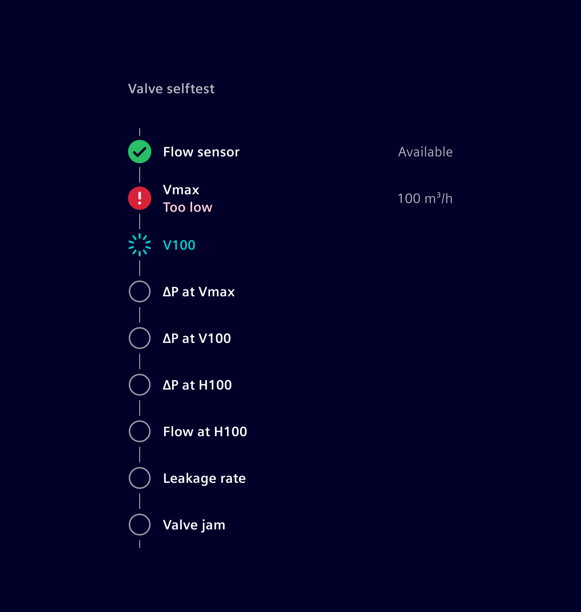
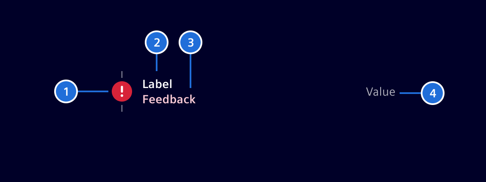
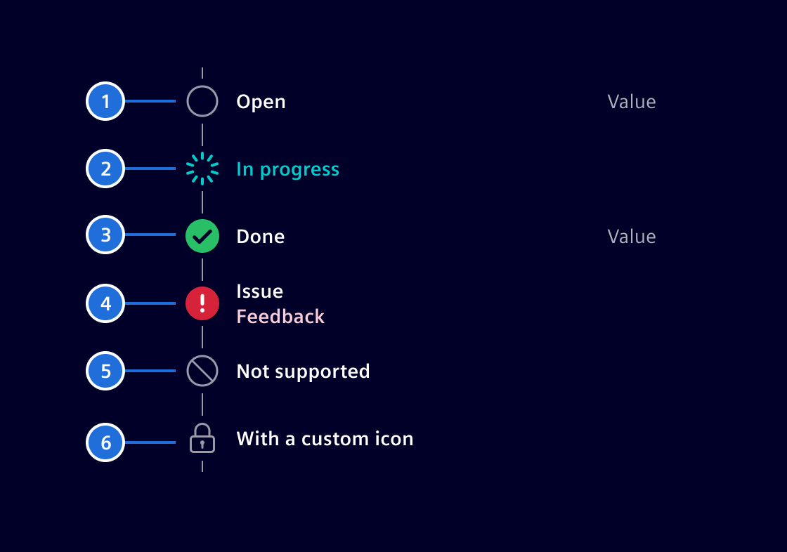

# Result details list

The **result details list** component allows to visualize a set of steps as part
of a procedure or process as well as their current status.

## Usage ---

It helps to visualize and communicate the steps (including status and results)
of a procedure or process. This can be used for scenarios like self-test
procedures, onboarding processes and more.



### When to use

- To visualize test procedures which require multiple steps that need to be
  performed in a specific order.
- For clear and effective communication of the current status and results.
- To communicate a timeline.

## Design ---



> 1. Icon, 2. Label, 3. Feedback (Optional), 4. Result value (Optional)

### Icon

- Icons give a visual cue about the current state or the kind of step.
- Basic icons are offered for the following steps: `Open`, `In Progress`,`Done`,
  `Issue` or `Unsupported`.
- The component allows also to use customized icons.

### Variations



> 1. Open step, 2. In progress, 3. Done, 4. Issue with optional feedback, 5. Unsupported step, 6. Customized icon

## Code ---

This component can be used to display a list of chronological steps for a
specific process.

Each step contains a `description` and a `state`. Optionally a step can have a
`value` as well as an `error message`. Each step can also define a `custom icon`
to be displayed.

This component requires an array of `ResultDetailStep` objects as
an input. The possible states are defined in the enum
`ResultDetailStepState`. More information can be found below.

### Usage

```ts
import { SiResultDetailsListComponent } from '@siemens/element-ng/result-details-list';

@Component({
  imports: [
    SiResultDetailsListComponent, ...
  ]
})
```

<si-docs-component example="si-result-details-list/si-result-details-list"></si-docs-component>

<si-docs-api component="SiResultDetailsListComponent"></si-docs-api>

<si-docs-types></si-docs-types>
