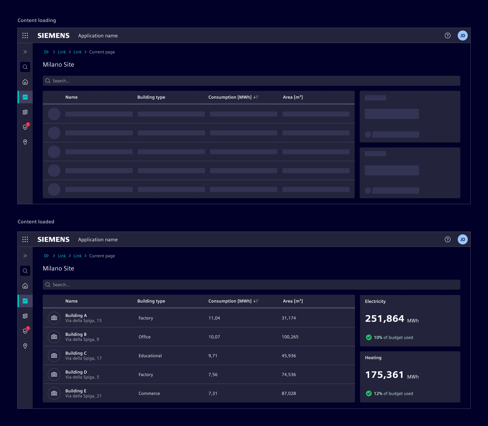
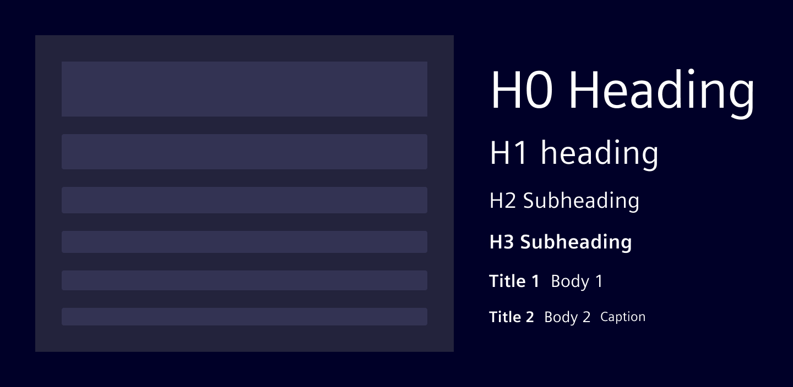
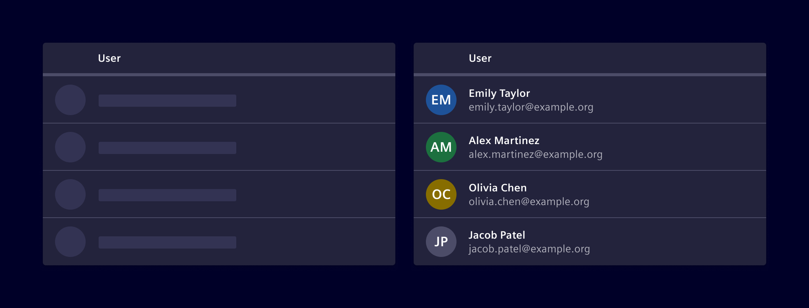
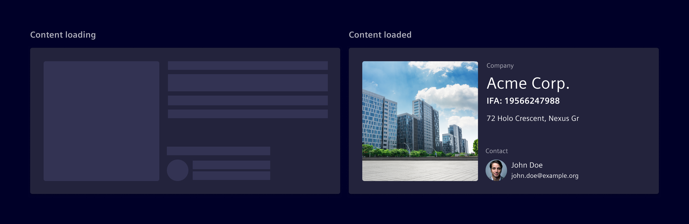

# Skeleton

The **skeleton** component is an animated placeholder for the information that
is still being loaded. It mimics the structure and look of the entire view and
provides an idea regarding what kind of content is loading in each block like
image, text, input, avatar, or more. It is used to create a perception of
reduced waiting time.

## Usage ---

Skeleton placeholders are temporary and simplified representations of page
components that are displayed during the initial page load.

They follow the shape and form of what will be loaded, representing the layout
and spacing of the actual content.

Rather than using skeleton placeholders to represent entire containers, it's
generally better to use them for specific **data-driven components** that may
take longer to load, such as tables, lists, and images.

### When to use

- To create an illusion of short page loading times when the load time is
  unknown.
- Use it when a [spinner](../progress-indication/spinner.md) component is not
  prominent enough.
- Use when there’s more than one element loading at the same time that requires
  an indicator.
- Use it only for the most significant graphic elements such as avatars, cards,
  content blocks, lists, and tables.

### Best practices

- Only show skeleton placeholders for a few seconds, hiding them once components
  and content populate the page.
- Avoid using it for action components (e.g. buttons, checkboxes, toggles).
- Avoid using skeleton placeholders to represent components that *contain* other
  components such as cards, accordions, and other layout elements.
- Map the skeleton placeholders to the expected size and shape of the data that
  will be replacing it once loaded.
- Don't use it for static content that never changes on a page, such as page
  titles, headings, and body text.
- Don't use it for fast processes that take less than `300ms`.
- When giving feedback for in-context operations, use the [spinner](../progress-indication/spinner.md)
  or [progress bar](../progress-indication/progress-bar.md) component.

## Design ---

### Typographic skeletons

Typographic skeletons represent placeholders for text content. The size of the
skeletons is based on the typographic style of the parent element.

When dealing with a lot of text, such as lists or tables, set a common length
for all placeholders to help maintain a consistent visual pattern.

For stacked lines of text, consider simplifying the representation by using a
single skeleton to indicate both lines. This reduces complexity while conveying
the layout and structure effectively.

### Shape skeletons

Shape skeletons represent placeholders for graphic elements such as icons,
avatars, and images.

To cover all possible graphic elements, *shape skeletons* can be either
**circular** or **rectangular**. Ensure that their size matches one of the
graphic elements they are representing.

### Animation

The skeleton placeholder uses a *shimmering* animation to provide a visual cue
that content is being loaded. This effect is created by a gradient moving from
left to right (in RTL languages, the gradient direction should be inverted),
which helps to make the experience feel faster and more seamless.

## Code ---

### Usage

Use the `si-skeleton` CSS class on any element to render a skeleton placeholder.
While loading data, display a HTML structure that is common to the final page
structure, but displays the skeleton as placeholder for data. Replace
the placeholders when loading is completed.

By default, the block-size height is `1em` to meet the text height.
Adjust the width (e.g. `w-100`) and the height for none text elements.

<si-docs-component example="si-skeleton/si-skeleton"></si-docs-component>
