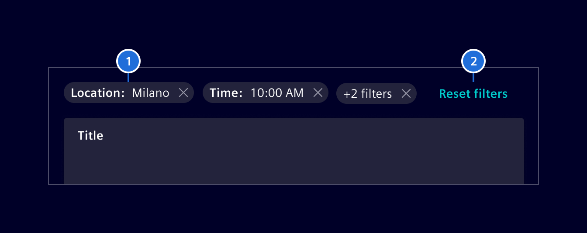
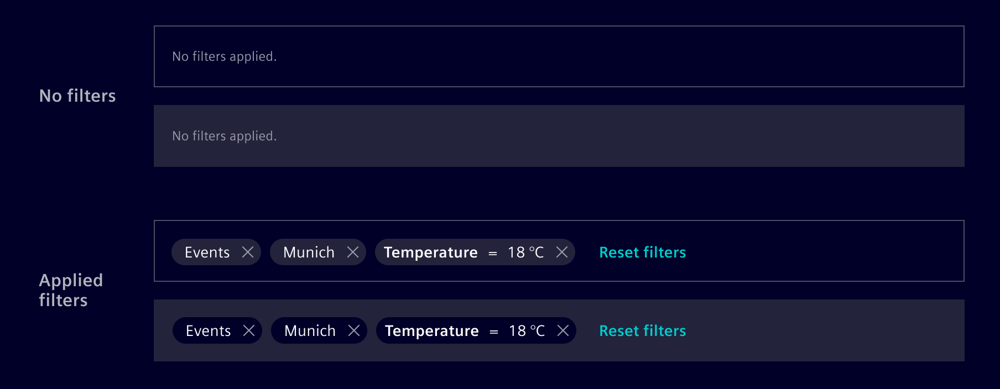
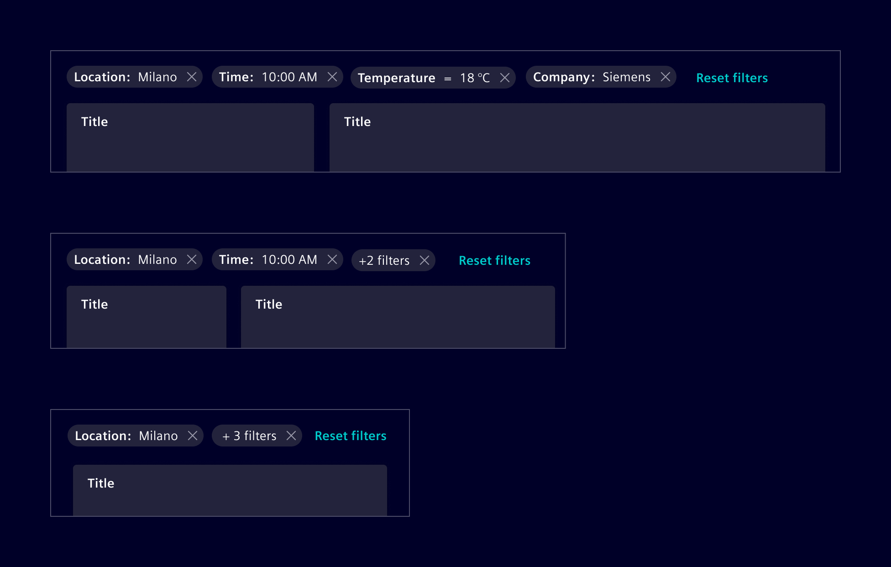

# Filter bar

A **Filter bar** is a horizontal collection of non-editable pills used to
represent the currently applied filters.

## Usage ---

The filter bar is placed above specific parts of the page, making it clear
that only those parts will reflect the applied filters.


### When to use

- Use it to represent the currently applied filters. The filters themselves must
  be set or changed using separate functionality.
- Use it if the filter doesn't have to be inline editable.
- Use it if more than 2-3 filter criteria need to be applied at the same time.

### Best practices

- Use one filter pill per filter category.
    - If only one option is selected, show the value (e.g. `Munich`).
    - If more than one option is selected, show the criteria name in plural with
      a counter (e.g. `7 cities`).
- Don't use a filter bar if you need to provide inline filter editing
  functionality. Use the [filtered search component](filtered-search.md)
  instead.
- Use an alternative text like `Applied filters` to make it accessible for
  visually impaired people and screen readers.

## Design ---

### Elements



> 1. Filter pills, 2. Reset filters button

### Interaction states

As the filter bar does not have a representation on its own, all interaction
states correspond to the *filter pills* and the *reset button*.

The *filter pills* container color should always be in contrast with its
surrounding background. Use `base-0` or `base-1` according to that.

The filter bar can be hidden completely, if no filter is applied.



### Responsive design

When reducing the viewport width, the filter pills should be grouped/combined
dynamically. The filter bar must not have a scroll bar and should never hide
the applied filters.



## Code ---

The filter bar is created for the purpose of user filtering and should be used in
combination with tables, lists, etc. This component serves as a visual component,
and always maintains the state of current active filters returned by
`filtersChange` output event, which triggers every time a user removes an item
from a filter. A two-way data-binding is also possible, e.g.
`[(filters)]="myFilters"`.

### Usage

```ts
import { SiFilterBarComponent } from '@siemens/element-ng/filter-bar';

@Component({
  imports: [SiFilterBarComponent, ...]
})
```

<si-docs-component example="si-filter-bar/si-filter-bar"></si-docs-component>

<si-docs-api component="SiFilterBarComponent"></si-docs-api>

<si-docs-types></si-docs-types>
