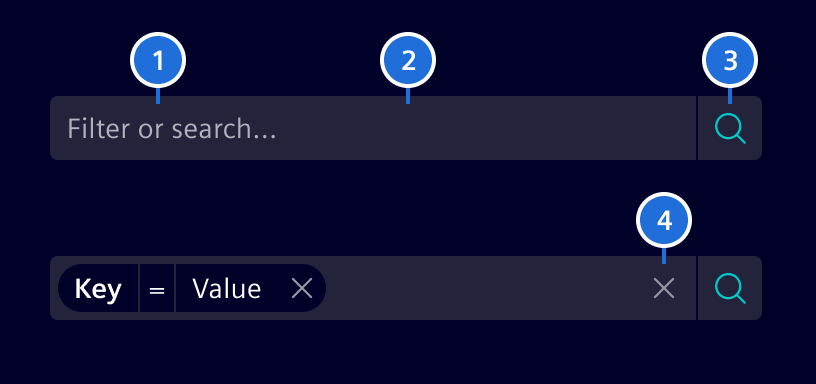
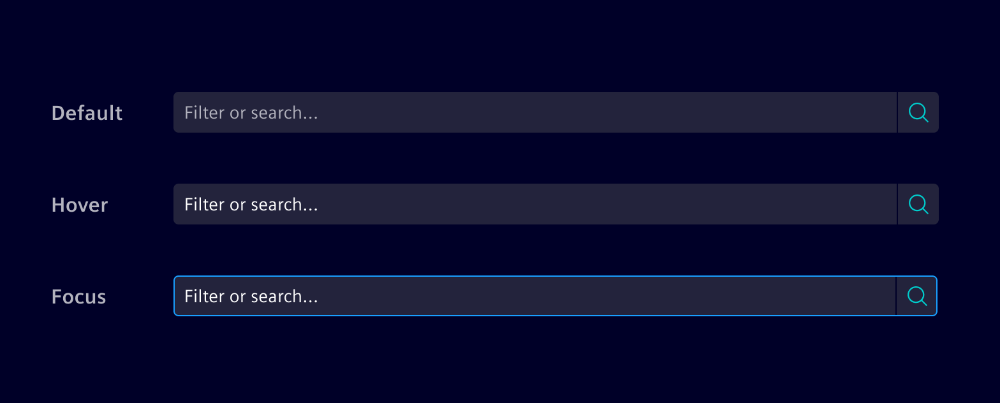
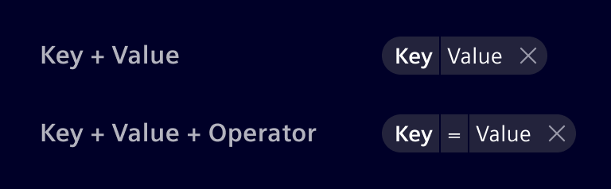
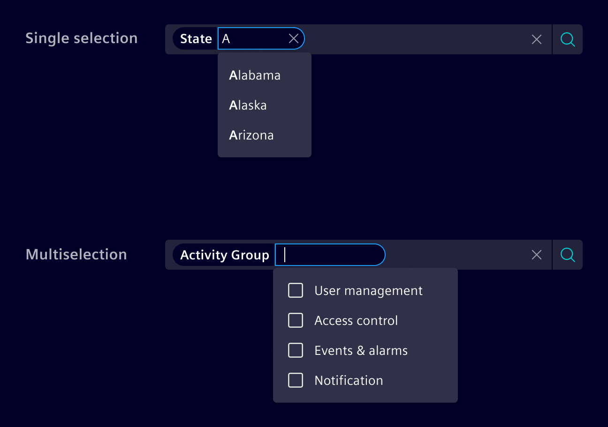
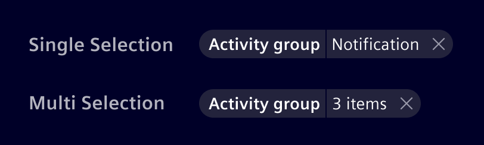

# Filtered search

**Filtered search** enables to search for free text in combination with structured
search criteria. The criteria are any numbers of criterion objects with a name
and a value.

## Usage ---


### When to use

- When users may not know exactly what they are looking for and want to explore options by selecting different filters.
- Use it when free-text search alone isn't enough, and structured criteria add value to the search process.
- Use it to create filter formulas by adding or excluding conditions.
- Use it where there is enough horizontal space to display filter options without cluttering the interface.
- If users need to apply many filters, especially with nested or hierarchical structures, consider other
  [filter patterns](../../patterns/filter.md).

### Best practices

- Use filtered Search with simple filter patterns (e.g. string, enumeration,
  integer, date/time) only.
- Always use strict criteria functionality and provide an explicit list of
  criteria.
- Ignore punctuation within searches.
- Consider adding other search capabilities according to project needs (e.g. use
  quotes to search for exact matches).

## Design ---

### Elements



> 1. Placeholder, 2. Container, 3. Search button, 4. Clear button

### Interaction states

The filtered search container color should always be in contrast with its
surrounding background. Use `base-0` or `base-1` according to that.



### Filter anatomy

Filtered Search is used in combination with the Filter Pills.
The filter can be composed of three different elements:

- **Key:** Targeted property or category.
- **Value:** Specific value of the property you are looking for.
- **Operator:** The intended relation between Key and Value (`=`, `>`, `<`, etc).

Combine the elements according to the complexity needed.



### Filter patterns

#### Character value (string)

It allows to input text to find content without a predefined set of options.


#### Numeric value (integer / float)

It allows to input numbers.
Usually has an operator and allows range filtering.


#### Enumeration

Enumeration contain a predefined set of values, from which the user can select
one option (single selection) or many (multi-selection). Combine with a
[typeahead behavior](typeahead.md) so users can enter the search value.



If more than one value is selected, an item count shall be shown in the filter
pill.



## Code ---

Assume you are searching for a person of a specific company and location.
Company and location are criteria with possible options like Siemens, Maximago
or Munich, Zug, etc. You can define possible search criteria by providing these
criteria with the input `[criteria]` as one object.  On pressing return, the
`(doSearch)` output callback event will provide you with an object describing
the selected criteria and the additional string, the user entered.

The `Criterion` type is used as input and output data type for this component.
It always has a `name` and optionally a `label` that is used for displaying to
the UI. As an input object, the `options` property is used to specify, which
options the users can select as value for the criterion. These options can be an
array of strings or an array of `OptionCriterion` which allows to specify a
value for the label and different value for doing the search. When search is
activated, the callback sets the selected option (the value itself or the
`value` property if `OptionCriterion` is used) as value in the `Criterion`
object.

<!-- markdownlint-disable MD051 -->
For more advanced use cases, custom comparison operators (e.g. `>` or `!=`)
can be used besides of the standard *equal* operator, while also restricting
the input to match a certain data type (e.g. `string` or `integer`). See the
[custom operators example](#filtered-search-custom-operators) for details.

By default, the user is allowed to enter additional criteria and criterion
values than initially configured. Additional criteria can be created by adding
a `:` after the written criteria (e.g. `additional:`).

Also good to know is that `Criterion values` are editable after they're created.
So you don't have to drop the whole `Criterion`.

This component uses [CSS Variables](https://developer.mozilla.org/en-US/docs/Web/CSS/Using_CSS_variables)
to make sizes and colors adjustable on the fly. Use the variable
`--filtered-search-font-size` in combination with `--filtered-search-line-height`
to adjust the size of the component.

### Usage

```ts
import { SiFilteredSearchComponent } from '@spike-rabbit/element-ng/filtered-search';

@Component({
  imports: [SiFilteredSearchComponent, ...]
})
```

### Filtered search - Basic

The following provides a basic example with pre-configured criteria and their
options. At a minimum, you must define the criteria. Other optional parameters
to define are:

- `(doSearch)` output for handling when user submits search criteria
- `[placeholder]` input for placeholder (empty string by default)
- `[submitText]` input for configurable 'submit' text ('Apply search criteria' by default)

<si-docs-component example="si-filtered-search/si-filtered-search-basic" height="300"></si-docs-component>

### Filtered search - Basic with predefined search criteria

This sample extends the first one by preselecting criteria.

<si-docs-component example="si-filtered-search/si-filtered-search-search-criteria" height="300"></si-docs-component>

### Filtered search - Lazy loaded criteria values

In many cases, your application defines the criteria, but the values need to be
loaded from a server. In this case you can provide an function that returns the
possible criterion options as an Observable.

<si-docs-component example="si-filtered-search/si-filtered-search-lazy-values" height="300"></si-docs-component>

### Filtered search - Lazy loaded criteria and category values

In addition to lazy loaded value, you can also lazy load the criteria itself.

<si-docs-component example="si-filtered-search/si-filtered-search-lazy-criteria" height="300"></si-docs-component>

### Filtered Search - Strict criteria

If you only allow the criteria defined, use `[strictCriterion]` to specify it.

<si-docs-component example="si-filtered-search/si-filtered-search-strict-criteria" height="300"></si-docs-component>

### Filtered search - Strict category values

If you only allow the criteria options defined, use `[strictValue]` to specify
it.

`[strictValue]` enforces `[strictCriterion]` to true automatically.

<si-docs-component example="si-filtered-search/si-filtered-search-strict-values" height="300"></si-docs-component>

### Filtered search - Trigger search value input

`[doSearchOnInputChange]` filters not applied explicitly ("Apply search criteria") only but implicitly
while typing or selecting the search criteria.

You can use `[searchDebounceTime]` to change the delay between the key stroke
and the search emission.

<si-docs-component example="si-filtered-search/si-filtered-search-value-trigger-search" height="300"></si-docs-component>

### Filtered search - Custom operators

For more advanced use cases, the `Criterion` type also allows to specify custom
comparison operators via the `operators` property. The operators are an array of
strings like `!=`, `<`, `>`, etc. The selected operator is then saved in the
`operator` property. To restrict the type of `value`, the `validationType`
property can be set to any of these values: `string`, `integer`, or `float`.
See the following example on how these properties can be used to filter for a certain
temperature range:

<si-docs-component example="si-filtered-search/si-filtered-search-operators" height="300"></si-docs-component>

### Filtered search - DatePicker

The following example shows the datepicker's use:

<si-docs-component example="si-filtered-search/si-filtered-search-datetime" height="300"></si-docs-component>

### Filtered search - Multi Select

The following example shows the use of multi select criterion:

<si-docs-component example="si-filtered-search/si-filtered-search-multiselect" height="300"></si-docs-component>

<si-docs-api component="SiFilteredSearchComponent"></si-docs-api>

<si-docs-types></si-docs-types>
