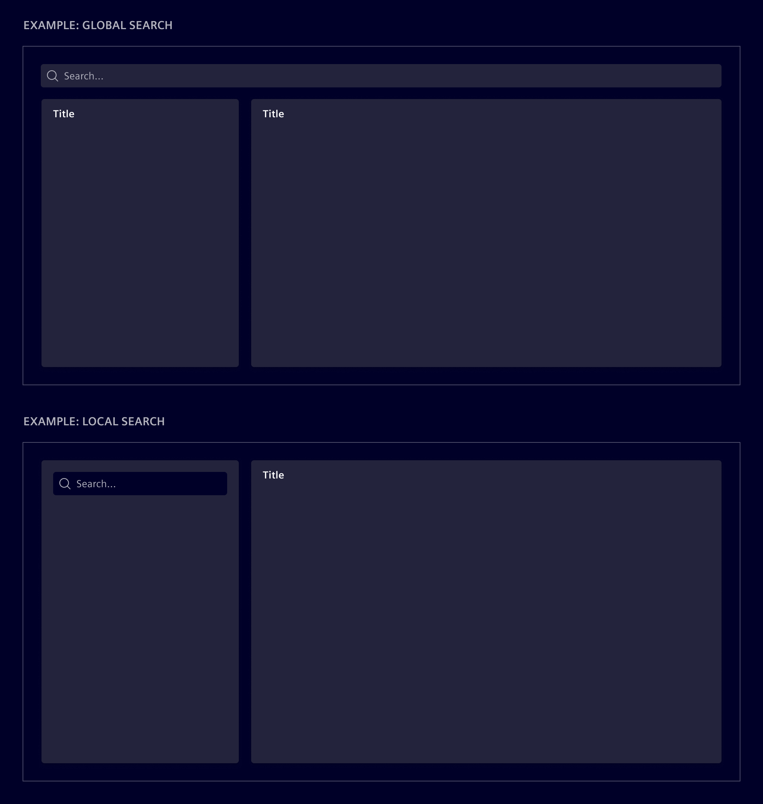

# Overview

**Filter, search and sort** are patterns that allow users to find and refine
information quickly and easily.

Filters enable users to narrow down a large set of entities by selecting
specific criteria, while search tools allow users to find specific entities by
typing in keywords or whole phrases. Sorting options allow users to arrange the
entities in a particular order, such as by date or relevance.

## Choosing the correct filter and search method

The choice between the different methods depends the nature of the content, the
user's goals, and the context of use.

- Use the [**Search Bar**](search-bar.md) component when the content is vast and
  diverse, and users are likely to look for specific information. It is also
  useful when users are familiar with the content and already know what they are
  looking for.
- Use the [**Filtered Search**](filtered-search.md) component when the content
  is complex and diverse. It allows users to search with free text in
  combination with structured search criteria. It can also be used to create
  filter chains by adding or excluding conditions.
- Use the [**Filter Bar**](filter-bar.md) component to display and manage
  filters applied to a set of data. It help users quickly understand which
  filters are currently applied and easily remove any filters they no longer
  need.

## Placement and scope

1. **Global filter and search:** Refers to search boxes or filters that affect
   the whole page. They are placed above all sections in the main content area.
2. **Local filter and search:** Refers to search boxes or filters that affect
   only one section of the page. They are placed in specific sections within the
   screen (e.g. on a card).

