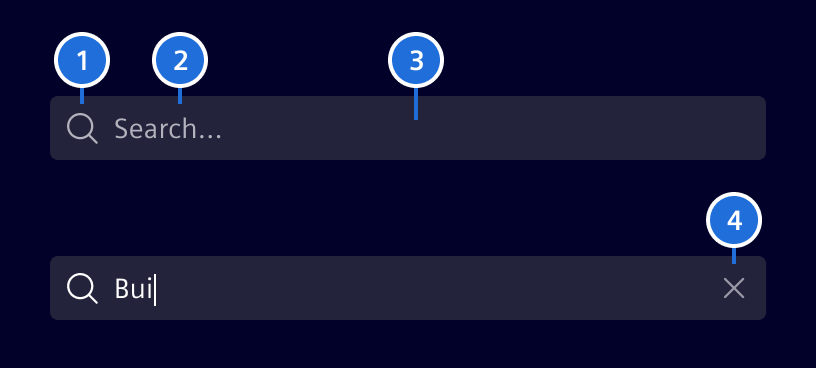
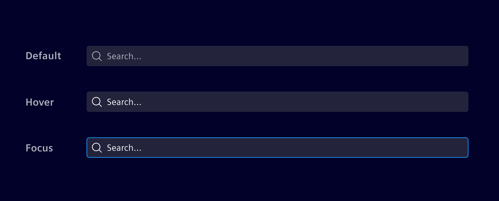

# Search bar

The **search bar** allows users to quickly find content using free text.

## Usage ---


### When to use

- Use it if a full text search is required.

### Best practices

- Ignore punctuation within searches.
- Combine with the [typeahead behavior](../sorting-filtering/typeahead.md) to
  assist users when searching.
- Don't use wildcard encoding for more complex search statements.
- Consider adding other search capabilities according to project needs (e.g. use
  quotes to search for exact matches).
- The placement of the *Search Bar* depends on the layout of the viewport. See
  the [main-detail container](../layout-navigation/main-detail-container.md)
  for placement guidance. See [data table](../lists-tables-trees/datatable.md)
  for search placement within a data table.

## Design ---

### Elements



> 1. Search icon, 2. Content, 3. Container, 4. Clear button

### Interaction states

The search bar container color should always be in contrast with its
surrounding background. Use `base-0` or `base-1` accordingly.



## Code ---

It has a callback, which can be seen in example as call to `getData()`, which
triggers every time a user has interaction with search bar. It also includes the
actual search term.

Input `[debounceTime]` is the wait time in `ms` for the search bar to notify
changes after a user stops typing. (Type: `number`, Default value: `400`).
  
Input `[showIcon]` defines if a search icon is displayed (false by default).

### Usage

```ts
import { SiSearchBarComponent } from '@spike-rabbit/element-ng/search-bar';

@Component({
  imports: [SiSearchBarComponent, ...]
})
```

<si-docs-component example="si-search-bar/si-search-bar"></si-docs-component>

### Search Bar - Input Value

Modify input value by setting `value`.

<si-docs-component example="si-search-bar/si-search-bar-value"></si-docs-component>

<si-docs-api component="SiSearchBarComponent"></si-docs-api>

<si-docs-types></si-docs-types>
