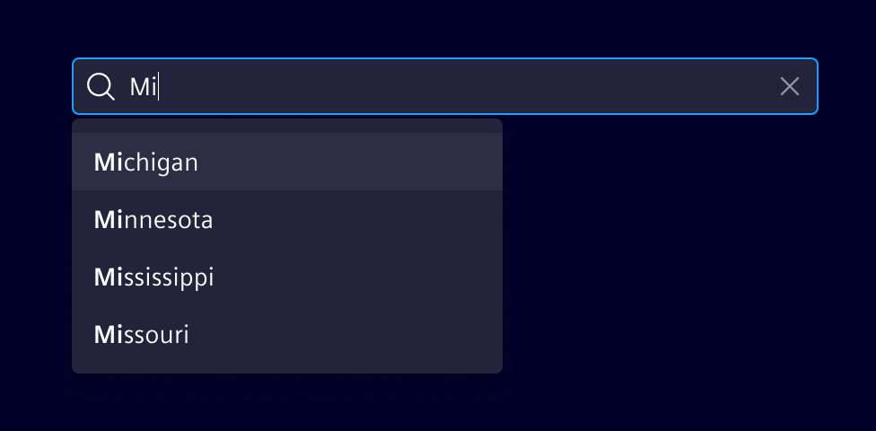
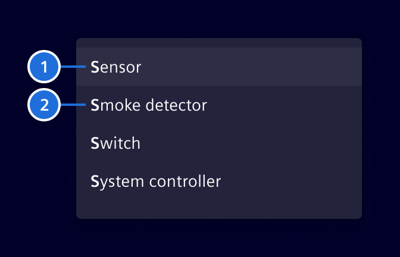

# Typeahead

**Typeahead** provides real-time, context-aware text completion.

## Usage ---

Typeahead is a behavior that helps users search for and select from a list of
suggested options by automatically predicting and completing their search
queries as they type.

This is commonly used in the [search bar](../sorting-filtering/search-bar.md),
[filtered search](../sorting-filtering/filtered-search.md), and other places
where users need to input text and select options from a list.



### Best practices

- Provide accurate and relevant suggestions.
- Avoid long lists by displaying between 5 to 10 suggestions at a time.
- When needed, provide a scroll bar to view more results beyond the initial
  list of suggestions.

## Design ---



> 1. Active suggestion item, 2. Suggestion item

## Code ---

The typeahead is used as a directive, so you can add it to any HTML input element.

### Usage

```ts
import { SiTypeaheadDirective } from '@spike-rabbit/element-ng/typeahead';

@Component({
  imports: [SiTypeaheadDirective, ...]
})
```

### Typeahead - Basic

This is the most basic typeahead you can get.
Tokenization is disabled here as it is not needed and normally enabled by default.

<si-docs-component example="si-typeahead/si-typeahead-basic" height="300"></si-docs-component>

### Typeahead - OnFocus & Scrollable

In many cases you would want the typeahead to already appear when the user focusses (click or tab into it) the input field.

Additionally, you maybe only want it to display after a certain amount of time
to allow the user to quickly tab through multiple input fields.

Lastly, a scrollable typeahead is the better option in many cases, especially if there are a lot of options.

Tokenization is disabled here as well as it is not needed and normally enabled by default.

<si-docs-component example="si-typeahead/si-typeahead-onfocus-scrollable" height="300"></si-docs-component>

### Typeahead - Async

If you want to load the typeahead options asynchronously, that is possible as well.

Just be sure to specify if you want it to be processed (searched and sorted)
because per default it is assumed that async options are pre-processed.

Additionally, here we disable the automatic selection of the first item
and prevent the typeahead from being closed using escape.

Tokenization is disabled here as well as it is not needed and normally enabled by default.

<si-docs-component example="si-typeahead/si-typeahead-async" height="300"></si-docs-component>

### Typeahead - Tokenized

The typeahead tokenizes the input/search by default by splitting it on whitespace characters.
Using the `typeaheadMatchAllTokens` input you can customize the search behavior.

Here it is left as the default `separately`, which means all the tokens need to have been found at least once where they don't overlap another token.

The options are as follows:

- `no` does not require all of the tokens to match.
- `once` requires all of the tokens to be found at least once.
- `separately` requires all of the tokens to be found at least once where there is not an overlapping different result. (default)
- `independently` requires all of the  tokens to be found at least once
where there is not an overlapping or adjacent different result.
(`independently` also slightly changes sorting behavior in the same way.)

<si-docs-component example="si-typeahead/si-typeahead-tokenized" height="300"></si-docs-component>

### Typeahead - Custom

If you want to customize the typeahead even more by using your own item template
and executing a function on select of an option, you can do that too.

Tokenization is kept enabled and `typeaheadMatchAllTokens` is set to `once` to match more results.

<si-docs-component example="si-typeahead/si-typeahead-custom" height="300"></si-docs-component>

<si-docs-api directive="SiTypeaheadDirective"></si-docs-api>

<si-docs-types></si-docs-types>
