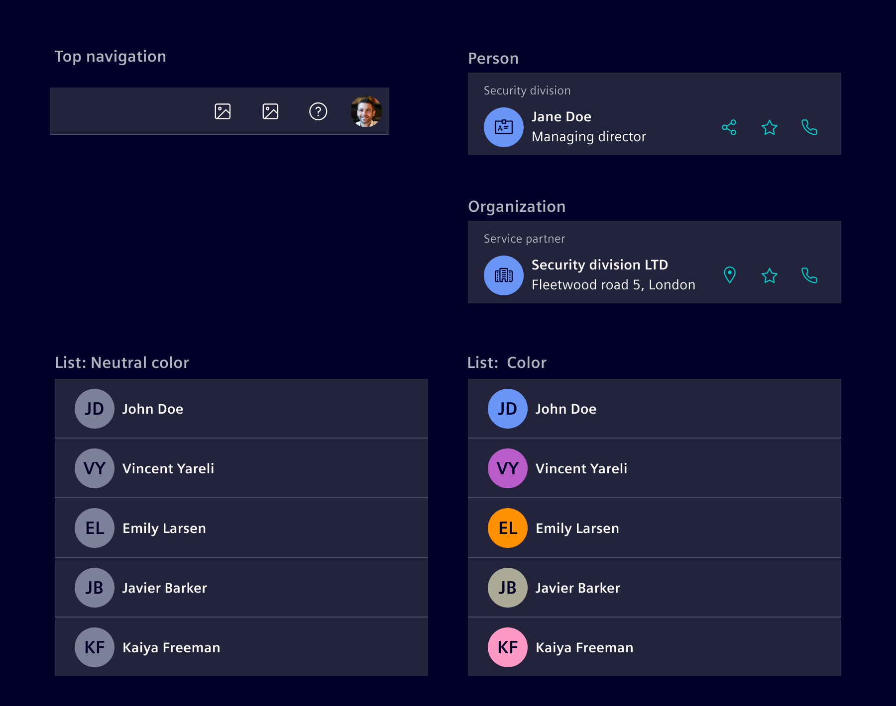
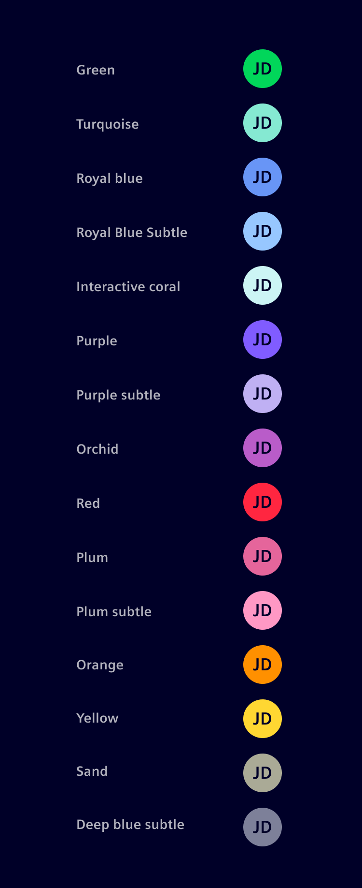
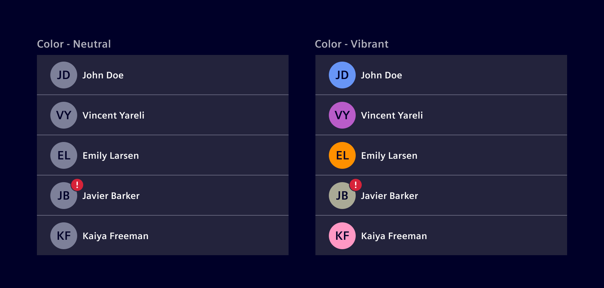
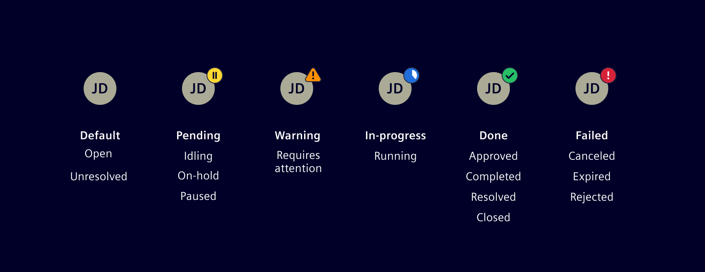
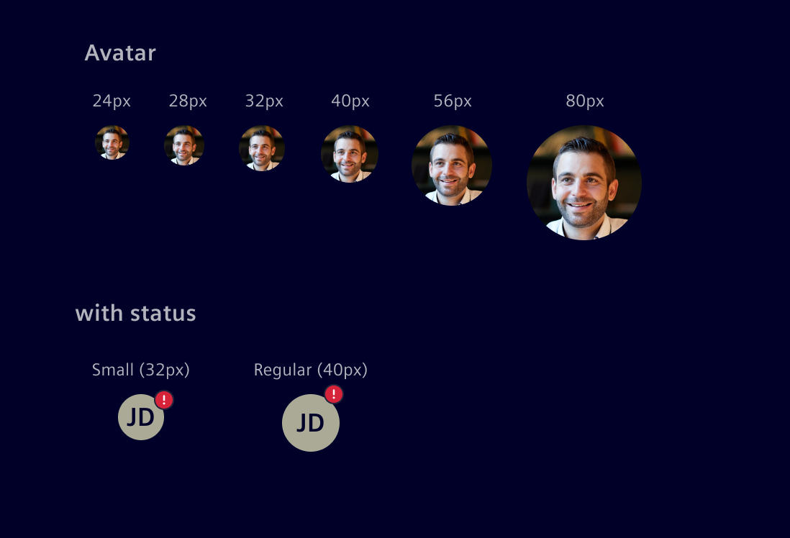

# Avatar

Avatars use images, icons or initials to visually represent an individual or an organization.
They can be a valuable tool for creating a more engaging and personalized user experience.

## Usage ---

Avatars may appear in any number of places. The key is for the same image, initials or icon to appear for a given object instance throughout the application. The size of an avatar may vary.

They are typically used in cards, lists, horizontal navigation and account page:



### When to use

- Use an avatar to help people efficiently identify another person or organization in the application visually.
- Use a profile avatar to represent an individual and an account avatar for an organization.
- Use an avatar to distinguish people.
- Use it to personalize the user experience: Avatars can be used to give users a sense of ownership and control over their accounts or profiles.

## Design ---

### Variants

The Avatar can show the content as image, intials or icon.


Generic rule of usage:

- **Image**: Use an image if the application offers the service for customization and an image is available.

- **Initals**: If no image is available, use up to two letters instead. If the record name contains two words, like first and last name, use the first capitalized letter of each.
For records that only have a single word name, use the first two letters of that word.

- **Icon**: If neither image nor initials are available, use the icon as fallback.

### Appearance

Depending on the situation, you can use a variety of options for the color.
The avatar color system presents 15 tokenized colors, each showcasing a distinct appearance in both light and dark themes.



Avatars can be colored with 'neutral' or 'vibrant' colors, depending on the needs of the application and the desired visual focus.



### Status

The component allows a colored indicator to be displayed in the top right corner.



### Sizes



The **avatar** component can be sized according to the project needs. Use a size which fits to the standard spacing and grid requirements.

- 24–40 px avatars are designed for headers, Horizontal Navigation, etc.
- 40–48 px avatars are often used in content blocks or lists.
- 56+ px avatars should be used in templates, such as profile, settings, etc.

Avatars with a status work best with the following sizes `Regular` (40px) or `Small` (32px).

## Code ---

### Usage

```ts
import { SiAvatarComponent } from '@spike-rabbit/element-ng/avatar';

@Component({
  imports: [SiAvatarComponent, ...]
})
```

<si-docs-component example="si-avatar/si-avatar" height="250"></si-docs-component>

<si-docs-api component="SiAvatarComponent"></si-docs-api>

<si-docs-types></si-docs-types>
