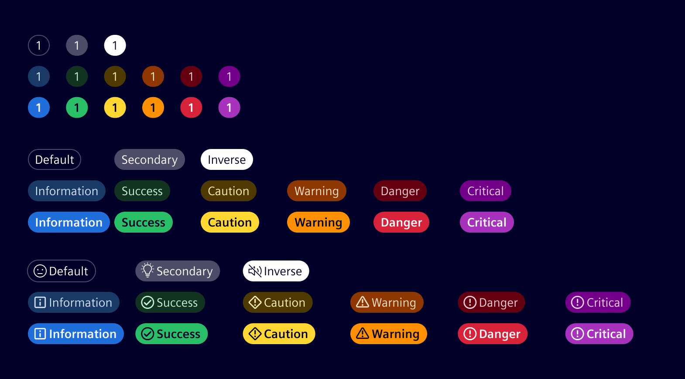

<!-- markdownlint-disable-file MD024 -->
# Badges

Badges act as visual aids notifying about a status of an object.
They carry different type of content such as a label or a counter to reflect a status.
Badges normally contain dynamic information.

## Usage ---

### Pill badge

Badges can display text or numbers, and may also include an icon. Choose between two visual styles: Default or Emphasis.

- Pill badges with text are usually integrated inside the data-tables and depicts each row's recent status.
- Used in conjunction with a single item or row to avoid ambiguity about which item is indicated.
- Pill badges can extend the width to fit desired text or numbers.
- Pill badges can also be used to indicate new or unread items with numbers.
- In case of a counter, the maximum count should be limited to 2 digits plus 1 character. For example `99+`.
- Status based categories are Default, Secondary, Inverse, Information, Success, Caution, Warning, Danger and Critical.

#### Best practices

- Consider the specified alignments while using Pill badges within the data-tables.
- Use status based categories to notify about a particular type of notification.
- Do not display status description in a badge.
- While showing a count, use integer numbers.
- If required, use tooltips for numbered badges to enhance user understanding.
- Place badges appropriately to identify the object they are informing or labelling.
- It is not recommended to use icons which are conflicting with semantic status color.

### Red dot tag with count

- These are global badges conveying a count and not a status.
- Use these to provide a visual cue of an object by notifying the recent changes.
- Maximum character count should be limited to 3 characters, i.e `99+`.

#### Best practices

- Use only natural numbers.
- Adjust the width to accommodate multiple digit numbers.
- Do not include text characters inside the badge.

### Red dot tag

- The red dot symbolizes a global notification update.
- If there is no content inside badge it can be represented with a simple dot.

#### Best practices

- Do not completely overlap the icon.
- Must be properly aligned to the upper right of the bounding box of the icon.
- Do not position badge out of the parent bounding box.

## Design ---

### Color variations - table

| Badges    | Status        | Fill Color                  | Text Style | Text Color                  |
|-----------|---------------|-----------------------------|------------|-----------------------------|
| Default   | Default       | `$element-base-0`           | `Title 2`  | `$element-text-primary`     |
| Secondary | Secondary     | `$element-ui-3`             | `Title 2`  | `$element-text-primary`     |
| Inverse   | Inverse       | `$element-ui-1`             | `Title 2`  | `$element-text-inverse`     |
| Blue      | Informational | `$element-base-information` | `Title 2`  | `$element-text-information` |
| Green     | Success       | `$element-base-success`     | `Title 2`  | `$element-text-success`     |
| Yellow    | Caution       | `$element-base-caution`     | `Title 2`  | `$element-text-caution`     |
| Orange    | Warning       | `$element-base-warning`     | `Title 2`  | `$element-text-warning`     |
| Red       | Danger        | `$element-base-danger`      | `Title 2`  | `$element-text-danger`      |
| Magenta   | Critical      | `$element-base-critical`    | `Title 2`  | `$element-text-critical`    |

## Code ---

The Badges are implemented using the Bootstrap Badges as a base. In addition to the Bootstrap badges,
we also provide `badge-dot`and `badge-text` classes to realize the smaller dots, typically placed at
the side of an icon.

### References

- **Bootstrap:** [Badges](https://getbootstrap.com/docs/5.1/components/badge/)

### Example

<si-docs-component example="badges/badges"></si-docs-component>
