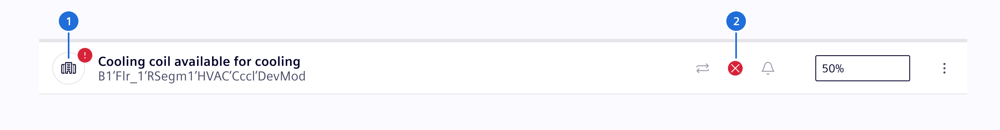
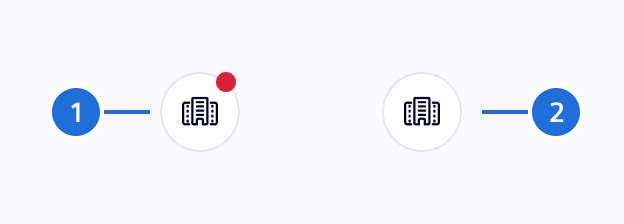
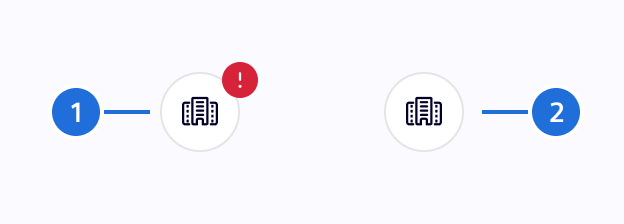
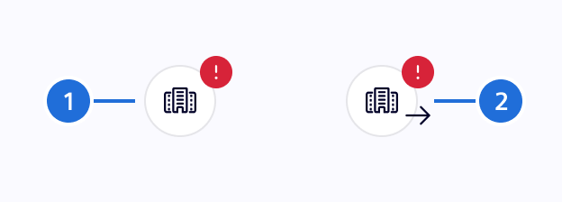
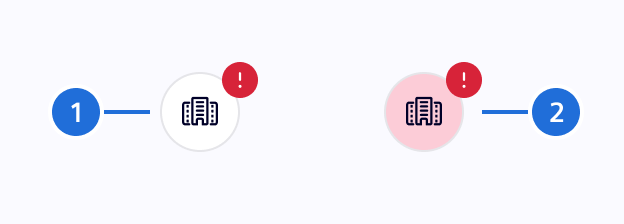

# Circle status

Circle status indicates states on a table or list.

## Usage ---



> (1) Circle Status indication, (2) Status icon

### When to use

- On a [table](../lists-tables-trees/datatable.md) or [list](../lists-tables-trees/list-group.md)
- At the beginning (left side) of a row
- Indicate the status on a type icon

### When a circle status might not help

- Outside of a table or list component
- Somewhere in the middle of the row
- In combination with a state icon

## Best Practices

- Badge on circle status shall be colored according definition for the [Status Colors](../../fundamentals/colors/ui-colors.md/#status)
- Use a *Circle Status* with badge (dot on top right of the circle) for simple indications, with **one specific status type** (`critical`, `danger`, ...) per viewport only
- Use a *Circle Status* with severity symbols when there is a need to identify different severities
- The color of the icon should remain constant according definition in [UI Colors](../../fundamentals/colors/ui-colors.md/#ui)

### Usage of Pulse feature

The pulse feature (blinking) is used to indicate places on the screen, where the user has to take immediate action.

!!! warning "Extensive use of pulse feature"
    - The pulse feature is made for an event list.
    - **Do not use the pulse feature outside of an event list**
    - Too extensive use of the pulse feature is reducing the expected effect to the user

## Design ---

### Error state with badge

Use a *Circle Status* with badge for simple indications, with **one specific
status type** (`critical`, `danger`, ...) per viewport only.
The status is indicated by a badge on top right of the circle.



> (1) Error state, (2) Default state

### Error state with severity symbols

Use a *Circle Status* with severity symbols when there is a need to identify
different severities.



> (1) Danger state, (2) Default state

### In and out events

When needed, a *Circle Status* can be integrated with the "in and out" event
representation.



> (1) Event in state, (2) Event out state

### Pulsating state

The pulse feature is adding a circle on the badge, which fades the opacity.



> (1) Pulse state ON, (2) Pulse state OFF

The rhythm and the fading must be in synch with the [Status Bar](../status-notifications/status-bar.md).

## Code ---

!!! info "No news are good news"
    The component does not implement the status `success`. Reason being a status
    should only be used when something has happened.

### Usage

```ts
import { SiCircleStatusComponent } from '@siemens/element-ng/circle-status';

@Component({
  imports: [SiCircleStatusComponent, ...]
})
```

<si-docs-component example="si-circle-status/si-circle-status" height="250"></si-docs-component>

<si-docs-api component="SiCircleStatusComponent"></si-docs-api>

<si-docs-types></si-docs-types>
