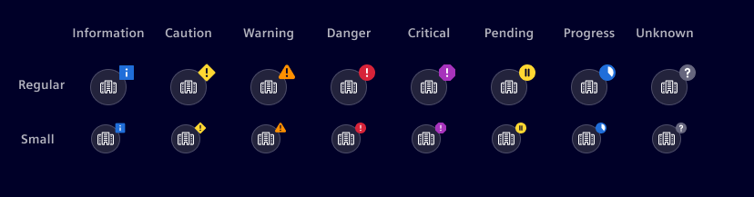
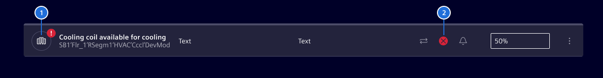
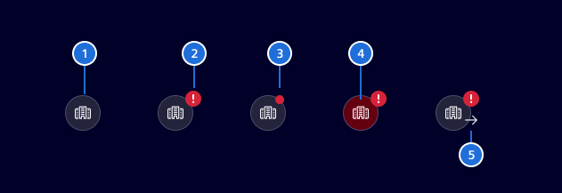

# Circle status

*Circle status* indicates states on a table or list.

## Usage ---

The circle status shows a type icon with a status indicator overlay.
The status can be a simple indication or a severity symbol: `Information`,
`Caution`, `Warning`, `Danger`, `Critical`, `Pause`, `Progress` or `Unknown`.
Circle status is available in two sizes: `Regular` or `Small`.





> 1. Circle status indication, 2. Status icon

### When to use

- On a [table](../lists-tables-trees/datatable.md) or [list](../lists-tables-trees/list-group.md)
- At the beginning (left side) of a row
- Indicate the status on a type icon

### When a circle status might not help

- Outside of a table or list component
- Somewhere in the middle of the row
- In combination with a state icon

## Best Practices

- Badge on circle status shall be colored according definition for the [Status colors](../../fundamentals/colors/ui-colors.md/#status)
- Use a *Circle Status* with severity symbols when there is a need to identify different severities
- The color of the icon should remain constant according definition in [UI colors](../../fundamentals/colors/ui-colors.md/#ui)

## Design ---

There are some variations in the representation of the circle status.



> 1. Default state, 2. Variant with status symbol, 3. Variant with dot, 4. Pulsating state, 5. Supporting icon

### Variant: Status symbol

Use a circle status with status symbols when there is a need to identify
different severities or states.

### Variant: Dot

Use the circle status with dot for simple indications, with **one specific
status color** (`critical`, `danger`, ...) per viewport only.
The status is indicated by a dot on top right of the circle.
To ensure accessibility, the circle status a severity symbol is the better choice.

### Pulsating

The pulse feature is adding a circle on the badge, which fades the opacity.
The rhythm and the fading must be in synch with the [status bar](../status-notifications/status-bar.md).

The pulse feature (blinking) is used to indicate places on the screen, where the user has to take immediate action.

The pulse feature (blinking effect) is used to highlight areas where the user needs to take immediate action.
It is intended specifically for event lists. Using it in other contexts or too frequently can reduce its effectiveness.

### Supporting icon

Add a supporting icon when needed to provide extra context, such as indicating an 'in and out' event.
While any icon can be assigned, ensure it adds meaningful context.

## Code ---

!!! info "No news are good news"
    The component does not implement the status `success`. Reason being a status
    should only be used when something has happened.

### Usage

```ts
import { SiCircleStatusComponent } from '@siemens/element-ng/circle-status';

@Component({
  imports: [SiCircleStatusComponent, ...]
})
```

<si-docs-component example="si-circle-status/si-circle-status" height="250"></si-docs-component>

<si-docs-api component="SiCircleStatusComponent"></si-docs-api>

<si-docs-types></si-docs-types>
