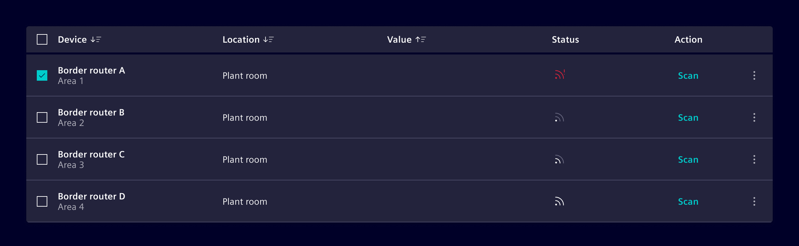
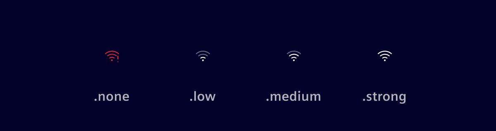

# Connection strength

The **connection-strength**-component informs the user about the signal quality of a connection in a simplified and graphical way.
It informs the user if there is an **issue with the signal** or about the signal quality [**strong**, **medium**, **low**].

## Usage ---

The **connection-strength**-component can be used in **tables**, **lists**, **cards** or any other component where the quality of a connection needs to be visualized to the user.



### Types

There are two different representations available:

#### Connection (General)


#### WLAN



### When to use

Use this component when you want to give the user more details about the signal quality, when e.g. a static icon will not be good enough.

## Code ---

### Usage

```ts
import { SiConnectionStrengthComponent } from '@siemens/element-ng/connection-strength';

@Component({
  imports: [SiConnectionStrengthComponent, ...]
})
```

<si-docs-component example="si-connection-strength/si-connection-strength" height="260"></si-docs-component>

<si-docs-api component="SiConnectionStrengthComponent"></si-docs-api>

<si-docs-types></si-docs-types>
