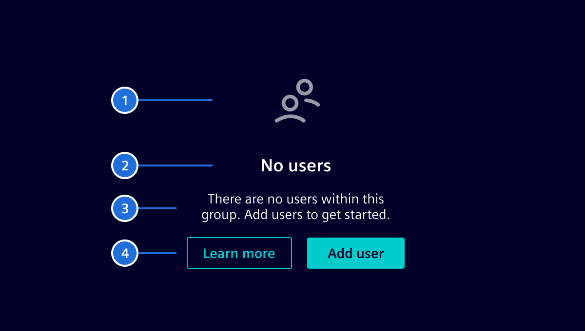

# Empty state

Use the `si-empty-state` component in places where you would normally display
data, but there is none available. For example, in lists with filters/search when
no data is left after filtering. You can customize the icon and text to your needs.

## Design ---



An empty state component consists of the following elements:

1. **Icon**: The object icon associated with the current view.
1. **Title**: A short and concise title to describe the state. A simple wording
  should be used (e.g. `No devices`) and full sentences shall be avoided.
1. **Text**: A more detailed explanation of the state, outlining the reasoning
  for it and how a user can resolve it (*optional*).
1. **Actions**: Allows the user to take actions to resolve the issue (*optional*).

## Code ---

### Usage

```ts
import { SiEmptyStateComponent } from '@siemens/element-ng/empty-state';

@Component({
  imports: [SiEmptyStateComponent, ...]
})
```

<si-docs-component example="si-empty-state/si-empty-state" height="230"></si-docs-component>

<si-docs-api component="SiEmptyStateComponent"></si-docs-api>

<si-docs-types></si-docs-types>
