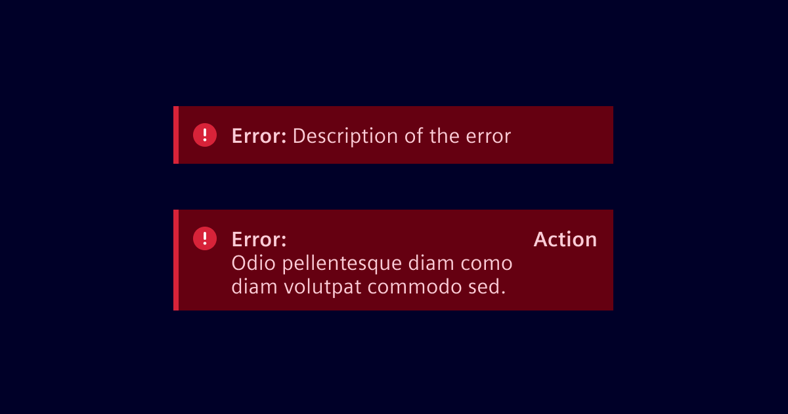
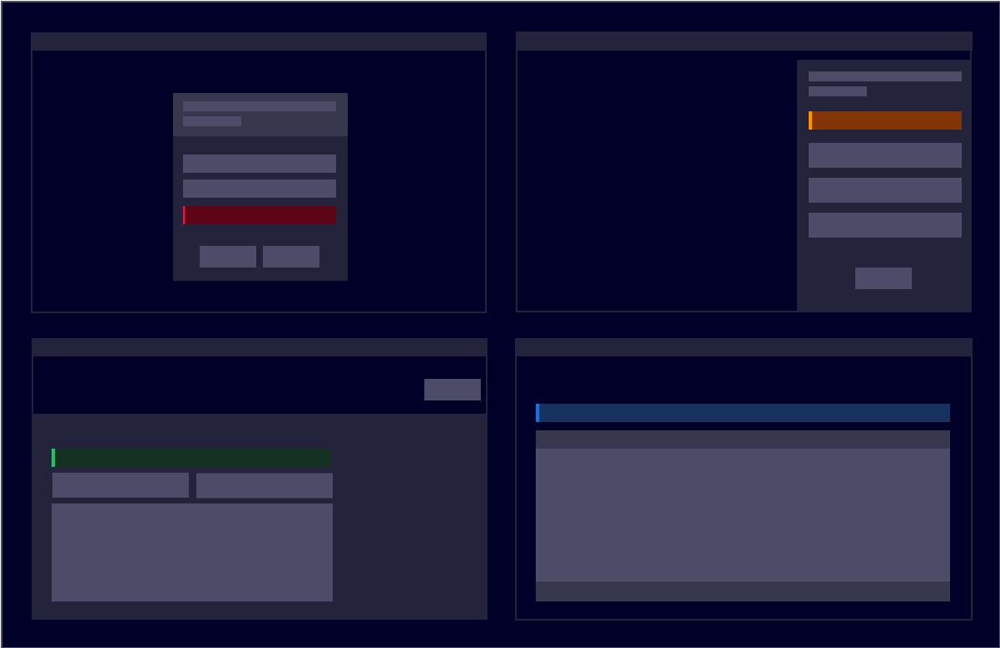
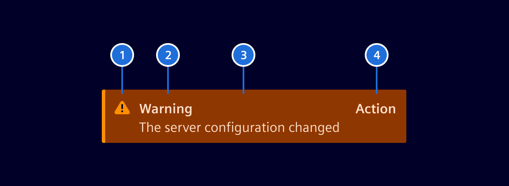
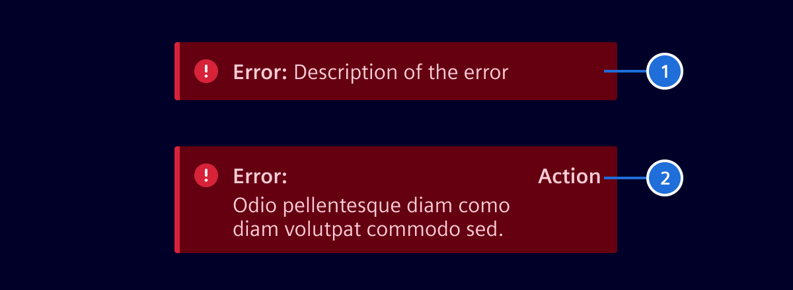
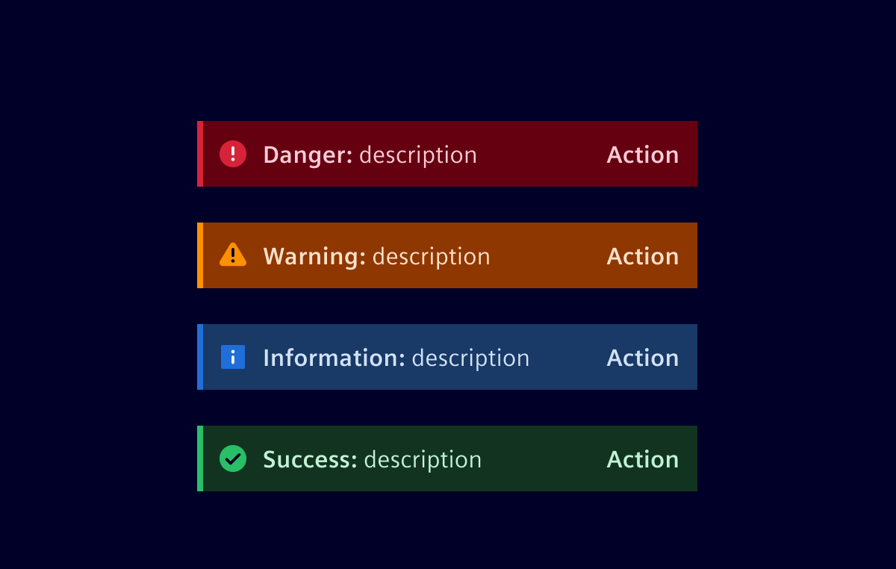

# Inline notification

**Inline notifications** show up in the task flow to provide feedback or the status
of an action. These notifications are task generated. They are persistent in
nature and vanish after the issue is resolved by user.

## Usage ---



### When to use

- Use inline notifications to show quick and precise feedback or status during
  the task flows.
- Use to notify status or feedback based on information, warning, success and
  danger.
- Usual places its usage are input fields like forms to show errors etc.

### Best practices

- Messaging should be context-based, short and concise.
- Do not overlap rest of the content.
- These are scrollable along with the other content on the screen.

### Formatting

The notification width varies based on the context and page layout. Their height
is based on the content length, which should not exceed two lines of text. Some
examples of layouts are form, right pane, banner etc.



## Design ---



1. **Icon:** Informs users about the severity of a notification.
2. **Title:** Gives users a quick overview of the notification (*optional*).
3. **Body Content:** Provides additional details of the notification.
4. **Action Button:** Area to take actions like canceling or resolving a notification (*optional*).

### Title and body content

A user should be able to quickly understand the notification and know what to do next.

### Action button



1. **No action:** Information only.
2. **Action:** Provides an action button.

### Notification types



## Code ---

This component is used to bring attention of users to a result of some action.
There are multiple options of what is the notification level: `information`,
`success`, `caution`, `warning`, `danger` and `critical`.

### Usage

```ts
import { SiInlineNotificationComponent } from '@spike-rabbit/element-ng/inline-notification';

@Component({
  imports: [SiInlineNotificationComponent, ...]
})
```

<si-docs-component example="si-inline-notification/si-inline-notification" height="310"></si-docs-component>

<si-docs-api component="SiInlineNotificationComponent"></si-docs-api>

<si-docs-types></si-docs-types>
