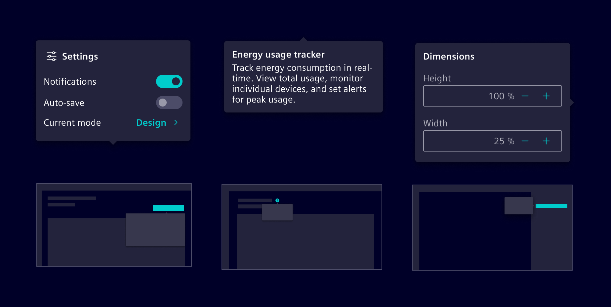
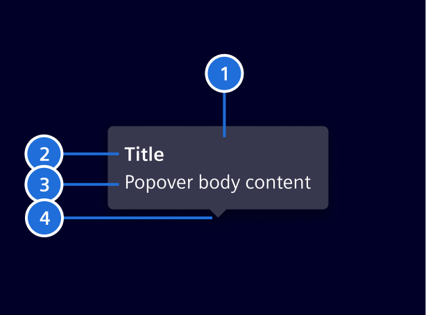
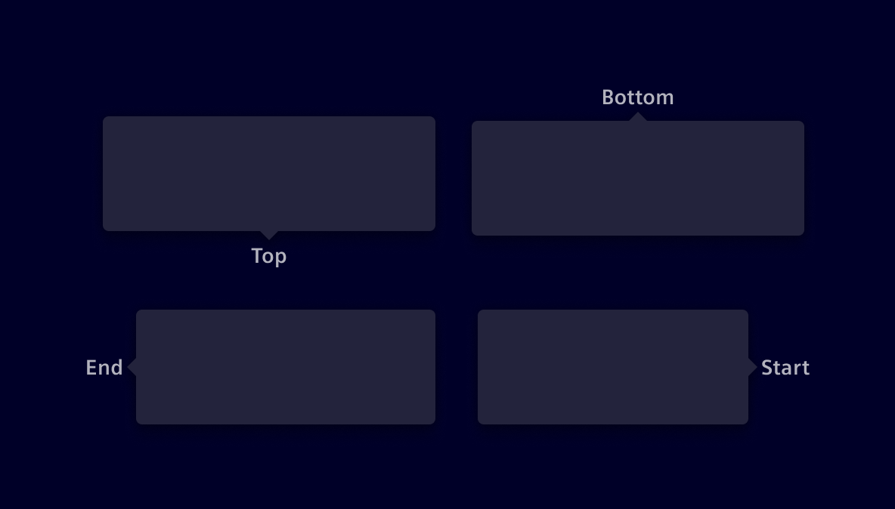
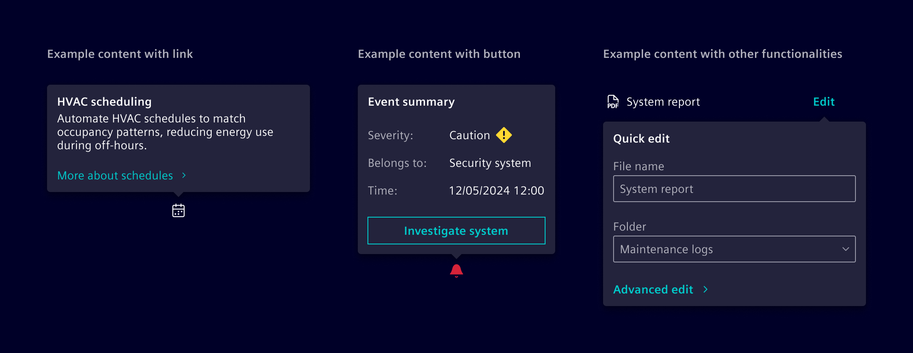

# Popover

A **popover** is a temporary overlay that displays above other content when users activate a trigger element.

## Usage ---

Popovers are used for brief, contextual information or temporary functionality that requires little screen space.
They appear when users select a specific control or interactive area and automatically close when
users select outside of them or complete an action within the popover.



### When to use

- To provide short, contextual information or additional functionality related to a control.
- For temporary content that doesn’t require a full page or modal view.
- To provide contextual help, guiding users with explanations or assistance specific to their current task.

### Best practices

- Limit functionality to a few related tasks or brief information.
- Avoid placing critical actions or decisions within a popover.
- Display only one popover at a time.
- Popovers should be just large enough to accommodate their content.

## Design ---

### Elements



> 1. Container, 2. Title (optional), 3. Body content, 4. Tip

### Placement

Four position options are available: **top**, **end**, **bottom** and **start**. Besides that,
**auto** option may be used to detect a position that fits the component on the screen. They should not cover too much of the screen or obscure important content.



### Content

Popovers can include text, links, buttons, and other interactive elements relevant to the task at hand.



### Tooltips vs. popovers

[Tooltips](../status-notifications/tooltip.md) are meant for supplementary,
non-essential information. They’re limited to brief, non-interactive text and **appear on hover**,
making them inaccessible on touch devices.

Popovers provide more comprehensive contextual information or functionality.
They open upon **user selection**.

| Component         | Tooltip                                            | Popover                                                  |
|-------------------|----------------------------------------------------|----------------------------------------------------------|
| **Purpose**       | Provides supplementary, non-essential information. | Displays contextual information or interactive elements. |
| **Interaction**   | Appears on **hover**.                              | Opens on **selection**.                                  |
| **Dismissal**     | Disappears when the cursor moves away.             | Requires user interaction to close.                      |
| **Interactivity** | Non-interactive, only displays text.               | Can contain buttons, links, and inputs.                  |

## Code ---

### Usage

Use `siPopover` directive to display the popover.

```ts
import { SiPopoverDirective } from '@spike-rabbit/element-ng/popover';

@Component({
  imports: [SiPopoverDirective, ...]
})
```

### Basic usage and positioning

<si-docs-component example="si-popover/si-popover" height="260"></si-docs-component>

<si-docs-api directive="SiPopoverDirective"></si-docs-api>

<si-docs-types></si-docs-types>

## Code (next) ---

The popover will be re-written to enhance its functionality. It will replace the existing popover as part of Element v48.
In the meantime, every element related to the new `si-popover` will have a `-next` suffix. With the `si-popover-next`,
accessibility will be improved through better compatibility with tools like screen readers and standardized focus management,
while its behavior will see some changes: the inputs `triggers`, `outsideClick` and `isOpen` will no longer be supported
because the popover will open only on click or selection, it will always close on an outside click, and the open state will be managed internally.

### Usage (next)

Use the `siPopover` directive to display the popover.

```ts
import {
  SiPopoverNextDirective,
  SiPopoverTitleDirective,
  SiPopoverDescriptionDirective
} from '@spike-rabbit/element-ng/popover-next';

@Component({
  imports: [SiPopoverNextDirective, SiPopoverTitleDirective, SiPopoverDescriptionDirective ...]
})
```

### Basic usage and positioning (next)

<si-docs-component example="si-popover-next/si-popover-next" height="260"></si-docs-component>

<si-docs-api directive="SiPopoverNextDirective"></si-docs-api>

<si-docs-types></si-docs-types>
