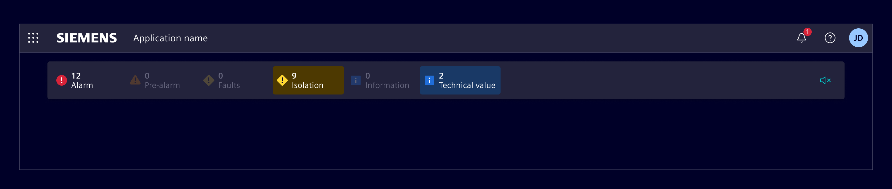
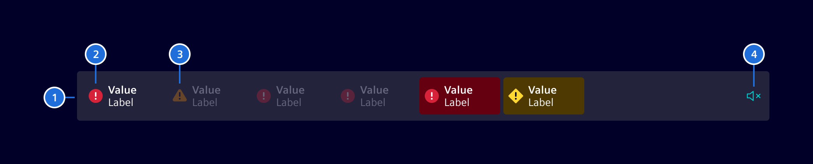
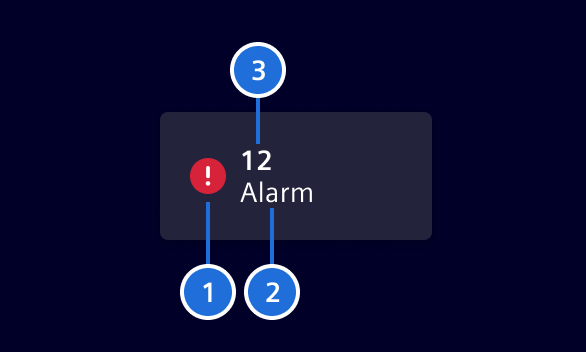
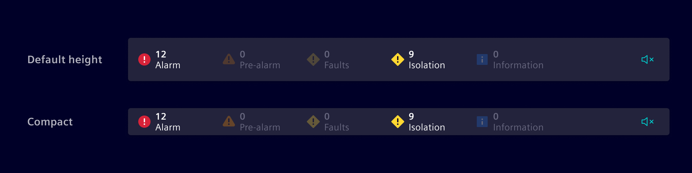
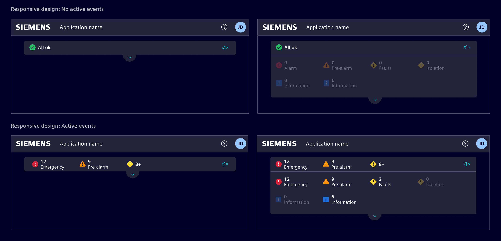
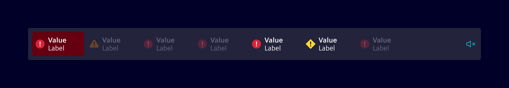

# Status bar

The **status bar** is used to convey crucial and system-wide information to
users. Different severity symbols help users to quickly evaluate and recognize
the current system status, providing the required information to take
appropriate actions.

## Usage ---



The **status bar** component informs a user about events or actions that
requires their attention and provides an easily accessible and summarized
overview of all ongoing events.

It is located just beneath the main horizontal navigation and is always visible
on all pages. If needed, each item can be a link to a page with detailed
information, containing all necessary means to identify and further analyze
a problem or specific status.

The status bar is not part of the scrollable content area, it stays at the same
position at all times.

### When to use

- Use it when some important status information has to be visible at all times,
  regardless of how deep the user navigated within an application.
- Use it to provide quick access to critical information that users need to be
  aware of at all times.
- Use it in combination with the [circle status](./circle-status.md)
  component.

### Best practices

- Only include the most relevant status information.
- Do not include more than `10` status categories.

## Design ---

### Elements



> 1. Container, 2. Status item active, 3. Status item inactive, 4. Mute button (optional)

Status items provide users with a quick way to see how many active events are
associated with each event category.



> 1. Event severity indicator, 2. Event category name, 3. Event counter

### Variants

If required, the status bar can be configured in a
*reduced height*/*compact mode*.



### Responsive behavior

The responsive behavior of the component ensures access to all information
regardless of the available screen size.

- If there are no active events, the status bar will display the message
  `All ok`.
- If there are more active items than can fit within the designated space, items
  will be moved to a collapsed menu and a summary indicator will be shown to
  indicate that more items are available.



### Pulsating state (optional)

To steer a user's attention to new and unhandled events in the status bar, the
status items support a *blinking* feature, which fades the background opacity.



## Code ---

Component for showing various status indicators and should be used below `si-application-header`.

Items in the status bar are clickable and will emit details of the item when
clicked.

### Usage

```ts
import { SiStatusBarComponent } from '@spike-rabbit/element-ng/status-bar';

@Component({
  imports: [SiStatusBarComponent, ...]
})
```

<si-docs-component example="si-status-bar/si-status-bar"></si-docs-component>

<si-docs-api component="SiStatusBarComponent"></si-docs-api>

<si-docs-types></si-docs-types>
