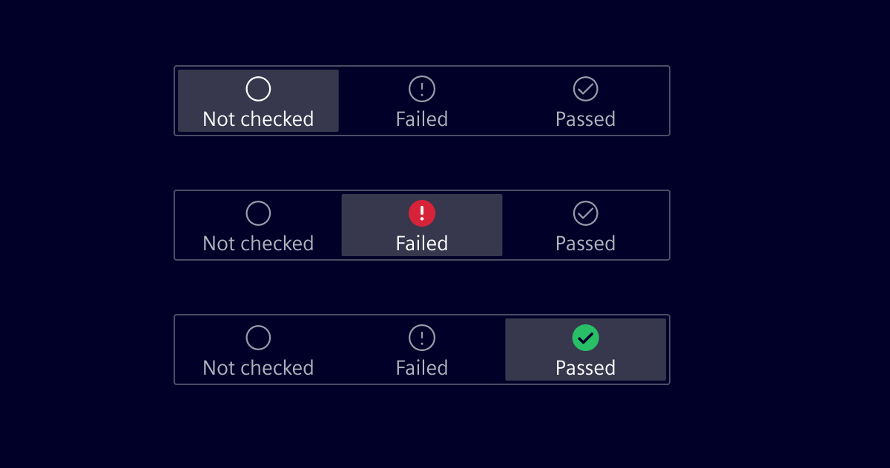
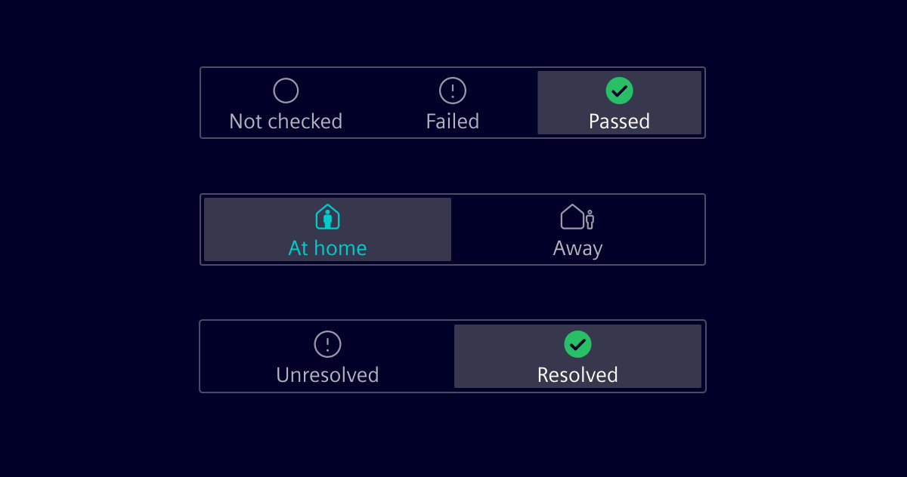
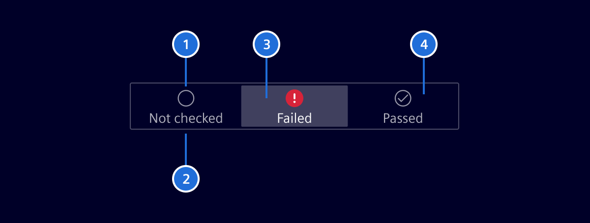

# Status Toggle

A status toggle allows a user to quickly set a status by tapping (primary action) on the desired status. Tap and drag to change the status (secondary-action) is also supported.

## Usage ---

### When to use

A status toggle is a good way to directly set a status on a screen, e.g. the result of a datapoint-test, home/away state, etc.

### Dos and don'ts

- In order to access it quickly, a status toggle should remain visible on the screen and not be part of the scrolling area.
- A status toggle can only hold 2 or 3 states.

## Design ---

### Elements

> 1. Icon, 2. Label, 3. Selected state, 4. Unselected state

### Label

- The label describes the state.
- Labels are concise and use no more than two words.
- The label will be truncated with 3 dots, if there is not enough space.
- The width of a label depends on the number of states.

## Code ---

<si-docs-component base="si-status-toggle" height="600">
  <si-docs-tab example="si-status-toggle" heading="All examples"></si-docs-tab>
</si-docs-component>

<si-docs-api component="SiStatusToggleComponent"></si-docs-api>

<si-docs-types></si-docs-types>
