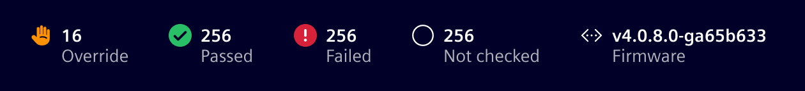
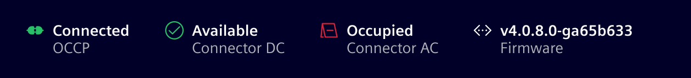
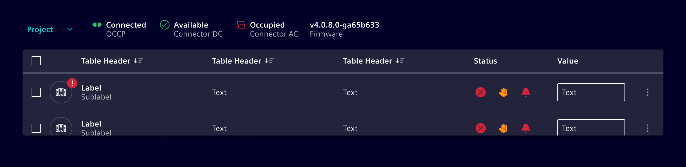
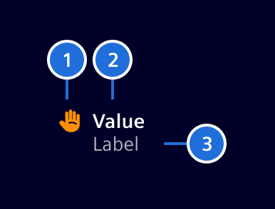
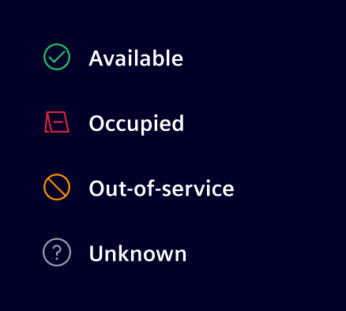

# Summary widget

**Summary widgets** are more detailed than summary chips and can include an optional icon (representing a category or state), a value, and a label.
These components are versatile and can be used to display various types of information, from summarizing data to visualizing current states or conditions.

## Usage ---

Summary widgets can be either selectable or read-only.
They may include an icon to visually represent the state or category of the displayed value. Additionally, labels can be added to provide extra context or clarification.

**Example: Overview of categories:**

**Example: Overview of states:**

- **Visual state representation**: Incorporate icons in summary widgets to visually represent the state or category of the displayed value.
- **Detailed summary**: Use summary widgets to provide more detailed summaries, including labels and additional context.
- **Readonly information**: Present detailed read-only information with clear labels and values.

### When to use

Use container component to organize a number of summary widgets or other elements such as buttons, links, and badges. The container can have a background of None, base-0, or base-1.

## Design ---

### Elements

> 1. Category icon or composite icon (optional), 2. Value, 3. Label

- **Icon**: The summary widget can hold an icon or a composite icon representing a state.
- **Value**: The primary numerical or textual value being summarized.
- **Label**: A short text label providing context or description of the value.

Here an idea of icons representing states:

### States

## Code ---

<si-docs-component example="si-summary-widget/si-summary-widget" height="250"></si-docs-component>

<si-docs-api component="SiSummaryWidgetComponent"></si-docs-api>

<si-docs-types></si-docs-types>
