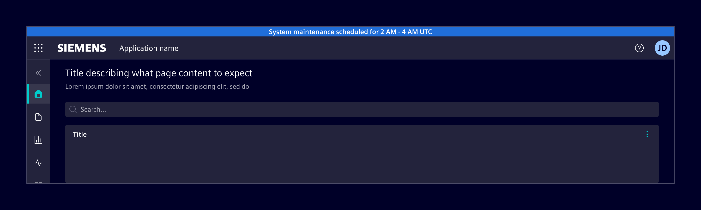
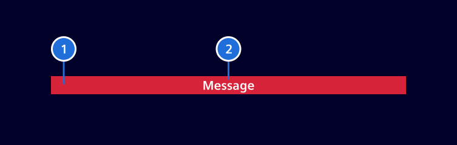
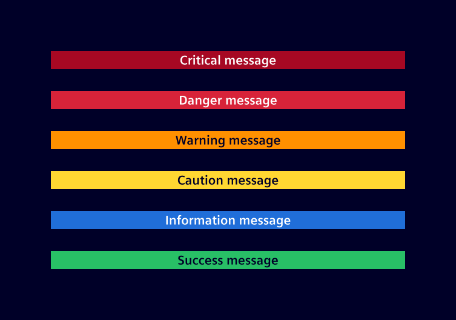

# System banner

The **system banner** is a prominent message displayed at the top of the screen to communicate system-wide updates, status changes, or information about the environment.

## Usage ---

The system banner is placed above the a [application header](../layout-navigation/application-header.md) to highlight important system-wide messages.
It supports various status types, including `information`, `success`, `caution`, `warning`, `danger` and `critical`.



### When to use

- To inform users about critical updates or changes.
- To notify users of any errors or issues.
- To provide important notifications, such as maintenance schedules or security alerts.

### Best practices

- Keep messages brief and easy to understand.
- Use clear, simple language. Avoid jargon and technical terms.
- Limit system banners to essential information to prevent clutter.
- Display system banners only when relevant to the user's context.

## Design ---

### Elements



> 1. Background, 2. Text message

### Variants



## Code ---

### Usage

```ts
import { SiSystemBannerComponent } from '@siemens/element-ng/system-banner';

@Component({
  imports: [SiSystemBannerComponent, ...]
})
```

```html
<si-system-banner message="This is an information" [status]="'info'"/>
```

## Displaying a system banner above the application header

To display a system banner above the [application header](../layout-navigation/application-header.md),
the following CSS classes must be applied:

- add `has-system-banner` on wrapper `div` which also contains `has-application-header`
or `has-navbar-fixed-top`
- add `fixed-top` on `si-system-banner`

<si-docs-component example="si-layouts/anatomy" height="500"></si-docs-component>

## System banner with different statuses

<si-docs-component example="si-system-banner/si-system-banner" height="250"></si-docs-component>

<si-docs-api component="SiSystemBannerComponent"></si-docs-api>

<si-docs-types></si-docs-types>
