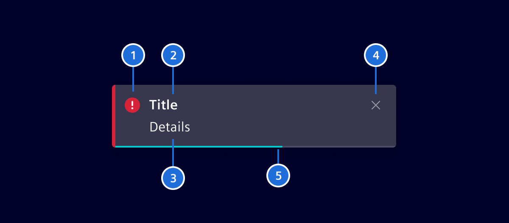
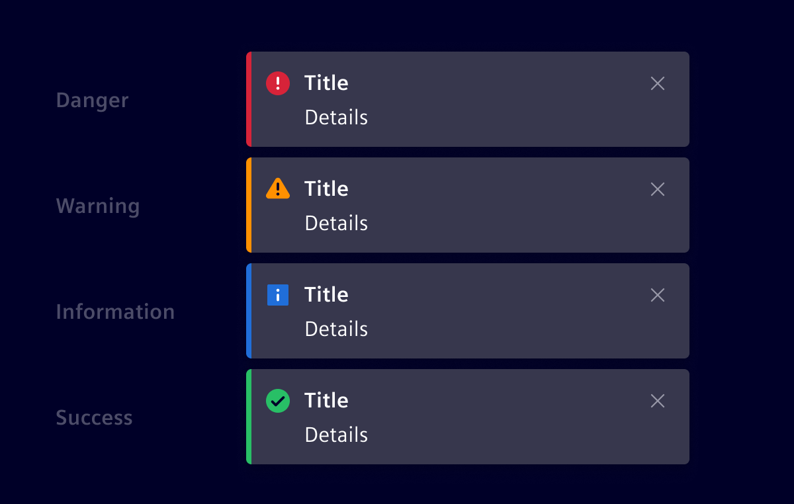

# Toast Notification

Toasts are short, time based notifications that slide in and out of a page.
These are best to use for providing system level feedback and status.

## Usage ---

### When to use

- Useful to show system or application level feedbacks and status.
  For example, lost network, number of items exceeded etc.
- Toasts display time based short and clear messages to user.
- Use these to give feedback based on `information`, `success`, `caution`, `warning`, `danger` and
`critical`.

### Dos and don'ts

- Keep the message context-based and under two lines.
- Appearance should be on the bottom right corner.
- Make toasts last for minimum 4-5 seconds.
- Toast notifications have a fixed width.

### Where Toast Notifications may not help

- Do not use for critical feedbacks.
- Do not use toasts for synchronous/co-occurring tasks like showing progress.
- Success toasts should not be used for every minor level use cases.

## Design ---

1. **Icon:** Informs users about the severity of a notification.
2. **Title:** Provides user with a quick overview about notification. Avoid
   words like `Information`, `Success`, `Caution`, `Warning`, `Danger` or
`Critical`in the title, use a real subject as a label.
3. **Content:** Provides additional details of the notification.
4. **Close:** A button to manually dismiss the notification *(optional)*.
5. **Timer:** Timer visualization until the notification disappears *(with timer variant)*.

### Notification Types

### Notification Variants

## Code ---

Used to display a notification as a toast that pops up from the bottom-right
corner of the screen.

### Usage

In any component the following steps need to be taken in order to display
a toast notification:

- An instance of the `SiToastNotificationService` needs to get imported and
  instantiated in your component's `constructor`.
- A variable of type `SiToast` needs to get created.
- The `SiToastNotificationService` has a method called `showToastNotification`.
  Call this method, and pass the previously created `SiToast` as the argument.

!!! note "Toast Notification Drawer"
    It is not needed anymore to insert the `si-toast-notification-drawer`
    manually into a main template as this is now automatically appended to the
    `<​body​>` tag by the `SiToastNotificationService`.

See the comments below for an example component that satisfies the above
criteria. Notice the `showToast` method that gets called when the *Show Toast*
button is clicked.

<si-docs-component example="si-toast-notification/si-toast-notification"></si-docs-component>

<si-docs-api injectable="SiToastNotificationService"></si-docs-api>

<si-docs-types></si-docs-types>
