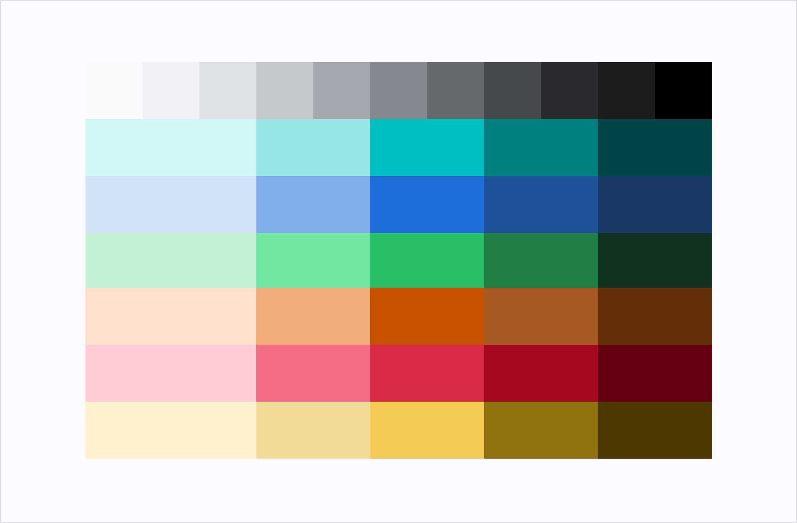

# Color Palette

<!-- markdownlint-disable MD013 MD038 -->

> **Note:** The documented colors are part of the Siemens branding and
> cannot be used for none Siemens applications. The color definitions
> are not part of the OSS package. Element comes with a default theme
> that is not part of the Siemens branding. The default theme is not
> documented.

*Element* includes a variety of solid colors and gradients to ensure a
consistent look is carried through any application.

Seven color families comprise the complete theme. The *Deep Blue / Gray* family is most
prevalent, making use of subtle shades for content organization.

The *Teal* family serves as the brand and primary action color. Other contextual
colors include *Success*, *Warning* and *Danger*.

Only colors from these families should be used for design and implementation
work.

The palette represents the universe of color possibilities in our interfaces.
Color definitions (primitives) presented below are the hexadecimal values that
we assign to a predefined set of colors. These primitives will be exclusively
used as values for color tokens.

## Deep Blue / Gray

| Sample                                                       | Color Variable               | Color Code |
|--------------------------------------------------------------|------------------------------|------------|
| <si-docs-color style="background: #FFFFFF;"></si-docs-color> | `$siemens-white`             | `#FFFFFF`  |
| <si-docs-color style="background: #ebebee;"></si-docs-color> | `$siemens-deep-blue-50`      | `#EBEBEE`  |
| <si-docs-color style="background: #e5e5e9;"></si-docs-color> | `$siemens-deep-blue-100`     | `#E5E5E9`  |
| <si-docs-color style="background: #ccccd4;"></si-docs-color> | `$siemens-deep-blue-200`     | `#CCCCD4`  |
| <si-docs-color style="background: #b3b3be;"></si-docs-color> | `$siemens-deep-blue-300`     | `#B3B3BE`  |
| <si-docs-color style="background: #9999a9;"></si-docs-color> | `$siemens-deep-blue-400`     | `#9999A9`  |
| <si-docs-color style="background: #7d8099;"></si-docs-color> | `$siemens-deep-blue-500`     | `#7D8099`  |
| <si-docs-color style="background: #66667e;"></si-docs-color> | `$siemens-deep-blue-600`     | `#66667E`  |
| <si-docs-color style="background: #4c4c68;"></si-docs-color> | `$siemens-deep-blue-700`     | `#4C4C68`  |
| <si-docs-color style="background: #333353;"></si-docs-color> | `$siemens-deep-blue-750`     | `#333353`  |
| <si-docs-color style="background: #40405e;"></si-docs-color> | `$siemens-deep-blue-755`     | `#40405E`  |
| <si-docs-color style="background: #23233c;"></si-docs-color> | `$siemens-deep-blue-800`     | `#23233C`  |
| <si-docs-color style="background: #12122e;"></si-docs-color> | `$siemens-deep-blue-875`     | `#12122E`  |
| <si-docs-color style="background: #000028;"></si-docs-color> | `$siemens-deep-blue-900`     | `#000028`  |
| <si-docs-color style="background: #000000;"></si-docs-color> | `$siemens-black`             | `#000000`  |
| <si-docs-color style="background: #f3f3f0;"></si-docs-color> | `$siemens-light-sand`        | `#F3F3F0`  |
| <si-docs-color style="background: #edede8;"></si-docs-color> | `$siemens-soft-sand`         | `#EDEDE8`  |
| <si-docs-color style="background: #DEDED7;"></si-docs-color> | `$siemens-dark-sand`         | `#DEDED7`  |
| <si-docs-color style="background: #E8E8E3;"></si-docs-color> | `$siemens-sand`              | `#E8E8E3`  |
| <si-docs-color style="background: #2D2D45;"></si-docs-color> | `$siemens-dark-grayish-navy` | `#2D2D45`  |
| <si-docs-color style="background: #37374D;"></si-docs-color> | `$siemens-grayish-navy`      | `#37374D`  |

## Interactive

| Sample                                                       | Color Variable                    | Color Code |
|--------------------------------------------------------------|-----------------------------------|------------|
| <si-docs-color style="background: #e0f1f4;"></si-docs-color> | `$siemens-interactive-blue-100`   | `#E0F1F4`  |
| <si-docs-color style="background: #73bac9;"></si-docs-color> | `$siemens-interactive-blue-300`   | `#73BAC9`  |
| <si-docs-color style="background: #006B80;"></si-docs-color> | `$siemens-interactive-blue-500`   | `#006B80`  |
| <si-docs-color style="background: #004f60;"></si-docs-color> | `$siemens-interactive-blue-700`   | `#004F60`  |
| <si-docs-color style="background: #00333e;"></si-docs-color> | `$siemens-interactive-blue-900`   | `#00333E`  |
| <si-docs-color style="background: #00ffb9;"></si-docs-color> | `$siemens-bold-green`             | `#00FFB9`  |
| <si-docs-color style="background: #c2ffee;"></si-docs-color> | `$siemens-light-bold-green`       | `#C2FFEE`  |
| <si-docs-color style="background: #001f39;"></si-docs-color> | `$siemens-dark-bold-green`        | `#001F39`  |
| <si-docs-color style="background: #00cccc;"></si-docs-color> | `$siemens-interactive-coral`      | `#00CCCC`  |
| <si-docs-color style="background: #007082;"></si-docs-color> | `$siemens-interactive-coral-db55` | `#007082`  |
| <si-docs-color style="background: #005159;"></si-docs-color> | `$siemens-teal`                   | `#005159`  |
| <si-docs-color style="background: #009999;"></si-docs-color> | `$siemens-petrol`                 | `#009999`  |
| <si-docs-color style="background: #199fff;"></si-docs-color> | `$siemens-focus`                  | `#199FFF`  |

## Blue

| Sample                                                       | Color Variable      | Color Code |
|--------------------------------------------------------------|---------------------|------------|
| <si-docs-color style="background: #D2E2F7;"></si-docs-color> | `$siemens-blue-100` | `#D2E2F7`  |
| <si-docs-color style="background: #81ADEB;"></si-docs-color> | `$siemens-blue-300` | `#81ADEB`  |
| <si-docs-color style="background: #206ED9;"></si-docs-color> | `$siemens-blue-500` | `#206ED9`  |
| <si-docs-color style="background: #1E5299;"></si-docs-color> | `$siemens-blue-700` | `#1E5299`  |
| <si-docs-color style="background: #193966;"></si-docs-color> | `$siemens-blue-900` | `#193966`  |

## Green

| Sample                                                       | Color Variable       | Color Code |
|--------------------------------------------------------------|----------------------|------------|
| <si-docs-color style="background: #C1F2D6;"></si-docs-color> | `$siemens-green-100` | `#C1F2D6`  |
| <si-docs-color style="background: #72E6A3;"></si-docs-color> | `$siemens-green-300` | `#72E6A3`  |
| <si-docs-color style="background: #28BF66;"></si-docs-color> | `$siemens-green-500` | `#28BF66`  |
| <si-docs-color style="background: #1C703F;"></si-docs-color> | `$siemens-green-700` | `#1C703F`  |
| <si-docs-color style="background: #12331F;"></si-docs-color> | `$siemens-green-900` | `#12331F`  |

## Yellow

| Sample                                                       | Color Variable        | Color Code |
|--------------------------------------------------------------|-----------------------|------------|
| <si-docs-color style="background: #fff2ba;"></si-docs-color> | `$siemens-yellow-100` | `#FFF2BA`  |
| <si-docs-color style="background: #ffd732;"></si-docs-color> | `$siemens-yellow-300` | `#FFD732`  |
| <si-docs-color style="background: #edbf00;"></si-docs-color> | `$siemens-yellow-500` | `#EDBF00`  |
| <si-docs-color style="background: #876d00;"></si-docs-color> | `$siemens-yellow-700` | `#876D00`  |
| <si-docs-color style="background: #4d3901;"></si-docs-color> | `$siemens-yellow-900` | `#4D3901`  |

## Orange

| Sample                                                       | Color Variable        | Color Code |
|--------------------------------------------------------------|-----------------------|------------|
| <si-docs-color style="background: #fee1cc;"></si-docs-color> | `$siemens-orange-100` | `#FEE1CC`  |
| <si-docs-color style="background: #ffba4a;"></si-docs-color> | `$siemens-orange-300` | `#FFBA4A`  |
| <si-docs-color style="background: #ff9000;"></si-docs-color> | `$siemens-orange-500` | `#FF9000`  |
| <si-docs-color style="background: #c75300;"></si-docs-color> | `$siemens-orange-700` | `#C75300`  |
| <si-docs-color style="background: #8f3700;"></si-docs-color> | `$siemens-orange-900` | `#8F3700`  |

## Red

| Sample                                                       | Color Variable     | Color Code |
|--------------------------------------------------------------|--------------------|------------|
| <si-docs-color style="background: #fcccd7;"></si-docs-color> | `$siemens-red-100` | `#FCCCD7`  |
| <si-docs-color style="background: #fe8389;"></si-docs-color> | `$siemens-red-300` | `#FE8389`  |
| <si-docs-color style="background: #d72339;"></si-docs-color> | `$siemens-red-500` | `#D72339`  |
| <si-docs-color style="background: #a60823;"></si-docs-color> | `$siemens-red-700` | `#A60823`  |
| <si-docs-color style="background: #650011;"></si-docs-color> | `$siemens-red-900` | `#650011`  |

## Gradients

Besides the colors, a small set of gradients is also defined, following the
semantic color scheme. Those gradients are only used for special use cases and
hence should not be used in other places.

| Sample                                                                                                         | Color Variable                       | Color Code                                                                                  |
|----------------------------------------------------------------------------------------------------------------|--------------------------------------|---------------------------------------------------------------------------------------------|
| <si-docs-color style="background: linear-gradient(114.59deg, #00ffb9 15.81%, #00cccc 84.42%)"></si-docs-color> | `$siemens-gradient-bold-dynamic`     | `linear-gradient(114.59deg, $siemens-bold-green 15.81%, $siemens-interactive-coral 84.42%)` |
| <si-docs-color style="background: linear-gradient(180deg, #00ffb9 15.81%, #00cccc 84.42%)"></si-docs-color>    | `$siemens-gradient-bold-dynamic-90`  | `linear-gradient(180deg, $siemens-bold-green 15.81%, $siemens-interactive-coral 84.42%)`    |
| <si-docs-color style="background: linear-gradient(180deg, #000028, #009999)"></si-docs-color>                  | `$siemens-gradient-deep-blue-petrol` | `linear-gradient(180deg, $siemens-deep-blue, $siemens-petrol)`                              |
| <si-docs-color style="background: linear-gradient(180deg, #000028, #1c703f)"></si-docs-color>                  | `$siemens-gradient-deep-blue-green`  | `linear-gradient(180deg, $siemens-deep-blue, $siemens-green-700)`                           |
| <si-docs-color style="background: linear-gradient(180deg, #000028, #206ed9)"></si-docs-color>                  | `$siemens-gradient-deep-blue-blue`   | `linear-gradient(180deg, $siemens-deep-blue, $siemens-blue-500)`                            |

