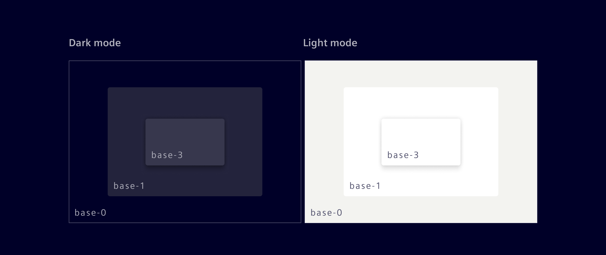
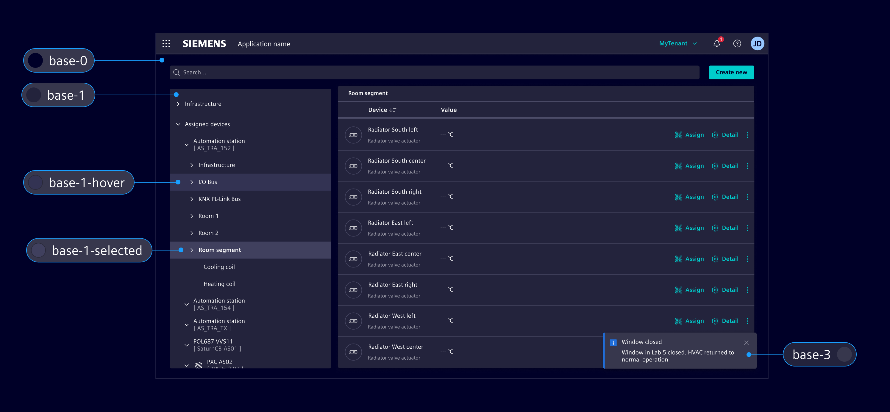
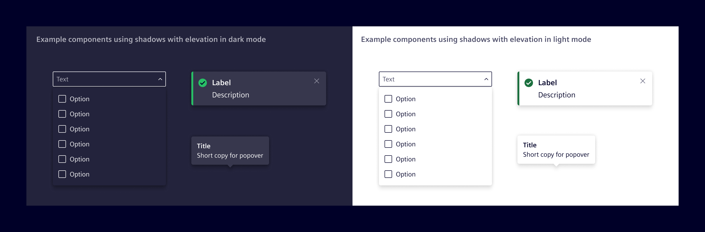

# Elevation

Elevation of a surface is represented by its distance from the page's background along the z-axis, creating a sense of depth and establishing content hierarchy within an application.

## Usage ---

In the Element Design System, elevation is achieved through a combination of layered **base colors** and **drop shadows**,
creating depth and spatial associations without unnecessary stylistic elements.

### Base color layers

At the core of the layering model are the **Base-0** and **Base-1** tokens:

- `base-0`: Is placed on the lowest position of the stack order, serving as the foundational background for the UI.
- `base-1`: Is placed on top of `base-0` and is the default layer for container elements like cards,
  vertical navigation, and side panels.
- `base-3`: Used to layer content above other content. It works best with shadows and is
reserved for components like popovers and toasts to enhance depth in low-light environments.



Complementary tokens like `base-1-hover` and `base-1-selected` are used
to indicate interaction states while maintaining the visual layering logic.



Avoid adding unnecessary layers or "boxes in boxes", as this can compromise clarity and usability.


### Shadows

Shadows are used selectively to indicate physical overlap between components.
Shadows are reserved for components that float above or overlap other content,
such as [menus](../components/buttons-menus/menu.md), modals, popover and toasts.

**Components without overlapping behavior, such as cards, must not have shadows.**



The `elevation` tokens represent increasing levels of shadows.

`elevation-2`: The active token used for overlapping components like menus, popovers, and toasts, establishing the standard elevation for floating elements.

The other tokens are retained for flexibility in custom visualizations, interactive
illustrations, or animations to enhance depth and spatial relationships.

- `elevation-1`: For minimal elevation effects and subtle layering.
- `elevation-3`: For elements requiring stronger visual prominence, such as multi-layered highlights.
- `elevation-4`: Reserved for rare or critical cases requiring maximum elevation distinction.

| Elevation | Token                  | Color            | Opacity (light) | Opacity (dark)  | X   | Y    | Blur
|-----------|------------------------|------------------|-----------------|-----------------|-----|------|-----
| Level 1   | `$element-elevation-1` | `$element-black` | 16%             | 40%             | 0px | 0px  | 4px
|           |                        | `$element-black` | 8%              | 20%             | 0px | 4px  | 4px
| Level 2   | `$element-elevation-2` | `$element-black` | 16%             | 40%             | 0px | 0px  | 8px
|           |                        | `$element-black` | 8%              | 20%             | 0px | 8px  | 8px
| Level 3   | `$element-elevation-3` | `$element-black` | 16%             | 40%             | 0px | 0px  | 16px
|           |                        | `$element-black` | 8%              | 20%             | 0px | 40px | 16px
| Level 4   | `$element-elevation-4` | `$element-black` | 16%             | 40%             | 0px | 0px  | 32px
|           |                        | `$element-black` | 8%              | 20%             | 0px | 32px | 32px

## Code ---

The 4 elevation levels (including `none`) in the form of `box-shadow` values can
be accessed directly by using CSS utility classes.

<si-docs-component example="elevation/elevation" height="120"></si-docs-component>

### Sass Variables

The shadow values for each *Element* elevation level can also be alternatively
used as SCSS variables within stylesheets. This also allows you to consume the
inset alternatives to the outside shadow variants.

```scss
@use '@siemens/element-theme/src/styles/variables';

box-shadow: variables.$element-elevation-1;
box-shadow: variables.$element-elevation-2;
box-shadow: variables.$element-elevation-3;
box-shadow: variables.$element-elevation-4;

box-shadow: variables.$element-elevation-inset-1;
box-shadow: variables.$element-elevation-inset-2;
box-shadow: variables.$element-elevation-inset-3;
box-shadow: variables.$element-elevation-inset-4;
```
