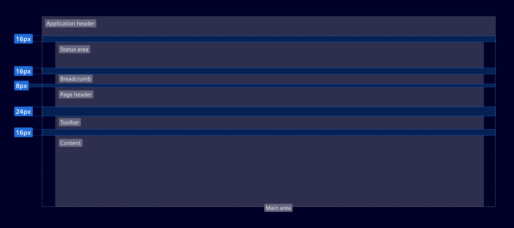

# Layout anatomy

The **layout anatomy** describes the building blocks, areas and spacing of a page.

## Usage ---

### Building blocks

- **[Application header](../../components/layout-navigation/application-header.md):** Is present in all screens.
  It can be used as the primary navigation and it contains system items such as user information, notifications, and more.
- **Vertical navigation:** It can be used as primary or secondary navigation with from top to bottom on the left side of a screen.
- **Main area:** Central area of the interface. Note, depending on the use case, the `side panel` may or may not belong to the `main area`.
- **Status area:** Designated for status-related elements, such as status bar
  or inline notifications.
- **Breadcrumb area:** Reserved for navigational aids like breadcrumbs.
- **[Page header](header.md):** It organizes elements that provide context to the current page,
  such as the title, description, and page-specific actions.
- **Toolbar area:** This flexible area may contain tools that alter the page's content, including search functions, filters, or additional actions.
- **[Content](content.md):** Specific content of the page.
- **Side panel:** Displays additional content or functionality
  that is related to the main content of a page and is specifically tailored to the current context or task.

Each of these elements is **optional**, with the exception of the horizontal navigation which is a mandatory feature.
Only use elements that are really needed. E.g. a vertical navigation with only one item does not make sense.  

### Horizontal spacing

Note, you should not use absolute pixel values for spacing. Element provides a
[grid system](grid.md) and many helper classes to set the corrected spacings.

## Code ---

Element provides components and CSS layout classes to support building a page.

- `.si-layout-main-padding` sets the padding of the main content
- `.si-layout-status` should be used for status information as the `<si-inline-notification>` or the `<si-status-bar>`
- `.si-layout-breadcrumb` should be used in combination with `si-breadcrumb`
- `.si-layout-header` and related CSS classes are documented at [Header](header.md)
- `.si-layout-top-element` marks the top element in the main area and adds extra space in the mobile viewport
  for the vertical navigation and the side panel.

If you have a toolbar, add 16px bottom margin to the content e.g. by adding the
utility class `.mb-6`.

The CSS classes are responsive and will automatically reserve space for the vertical-navbar
and the side-panel.

<si-docs-component example="si-layouts/anatomy" height="600"></si-docs-component>
