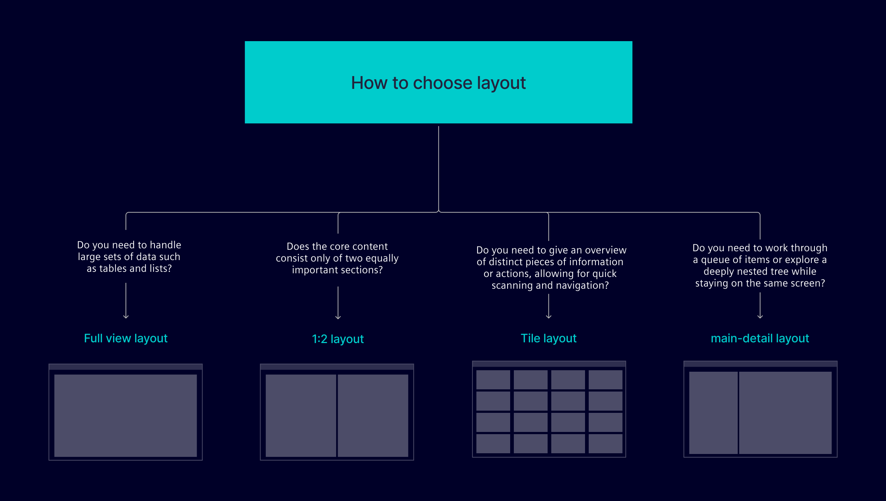
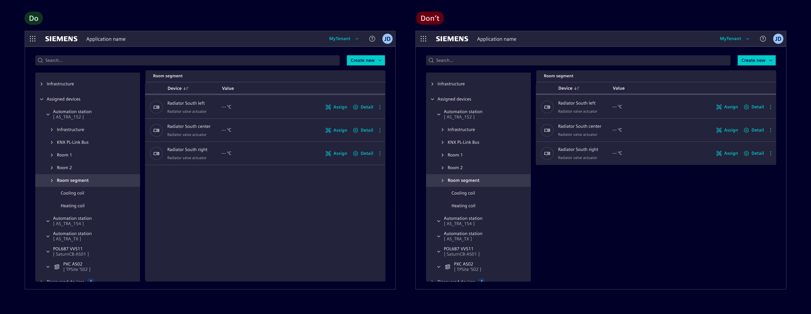
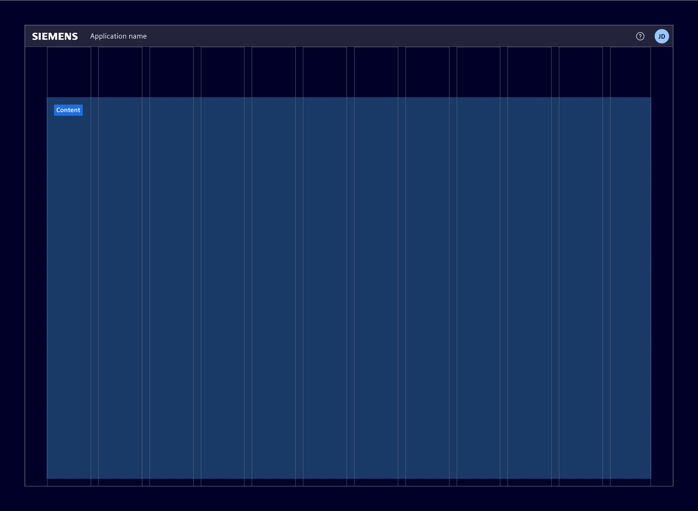
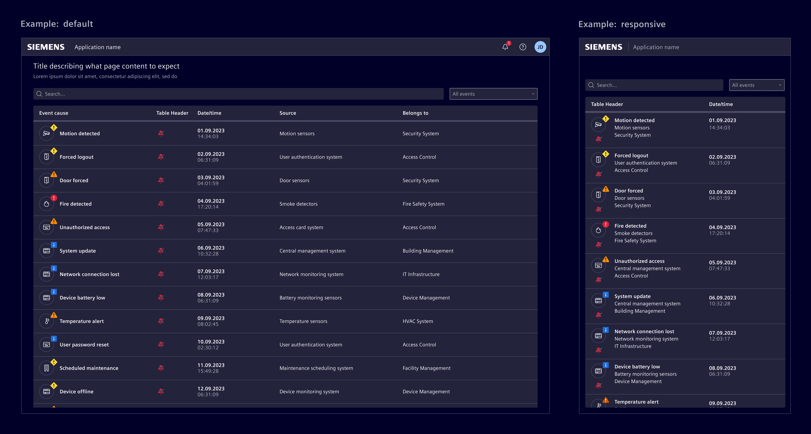
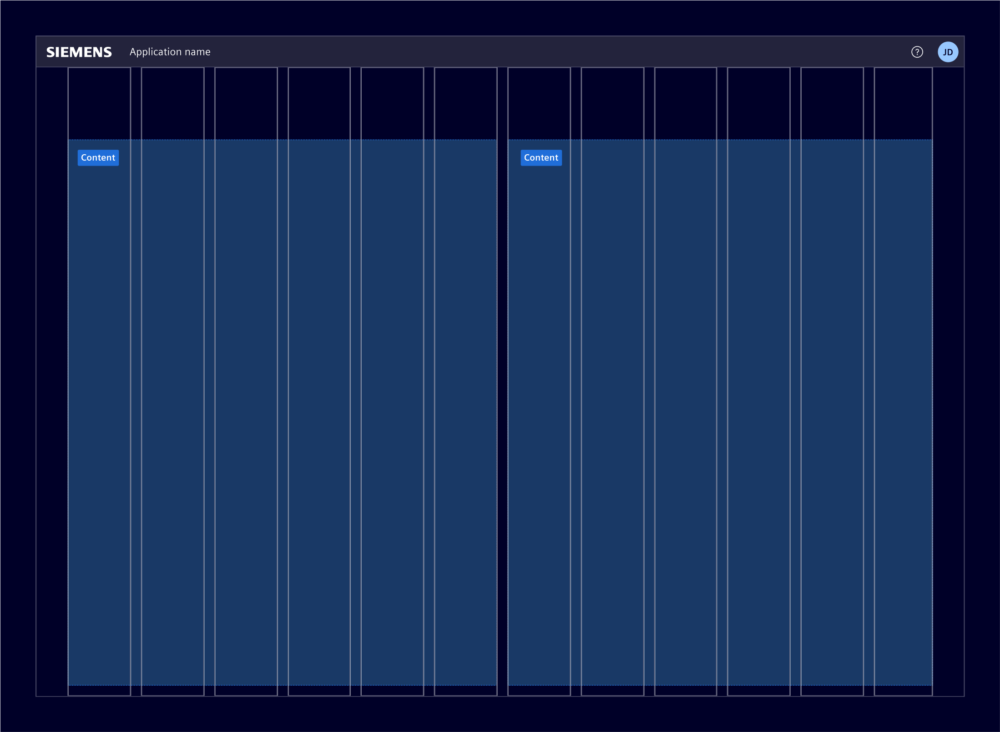
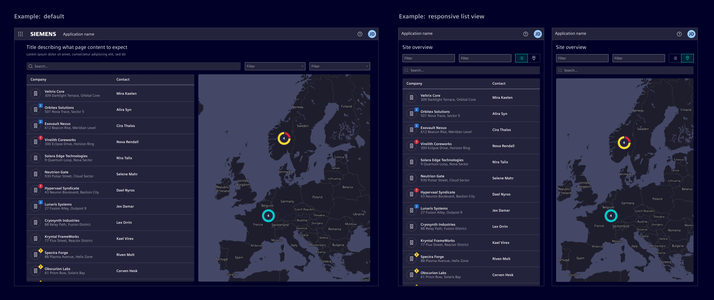
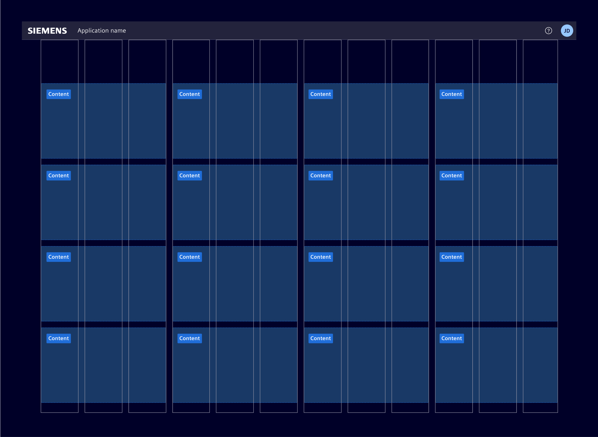
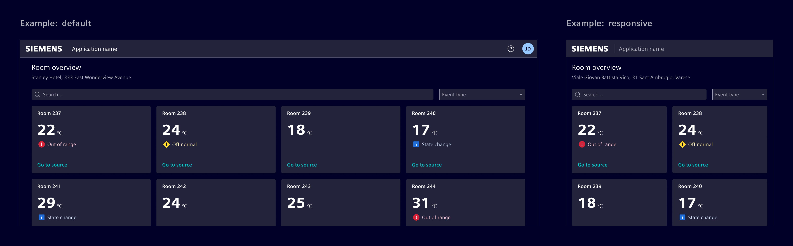

# Content layouts

**Content layouts** refer to standardized templates for arranging visual elements
and content on a page.

## Usage ---

Content layouts should be used as starting points and adapted as needed to meet
unique requirements. The layouts resides in the `content` area of the [page anatomy](anatomy.md).



### Content area behavior

In all the mentioned layout types, it's important to consider how the content
area is managed:

- **Full scroll**: The content takes the needed vertical space and extends as
  users scroll down.
- **Fixed height:** The application height is fixed to the height as the browser
  window. The content area resizes vertically and fills the height. Any content
  overflow is handled with inner scroll bars.

#### Scaling considerations

- When displaying structured data (e.g., tables, lists, or trees), ensure that the container maintains a consistent height,
  even if only a few entries are present.
- Ensure visual balance between related content containers (e.g., main-detail). Avoid situations where one container stretches while another
  remains mostly empty, creating asymmetry in the layout.



### Flexibility

Layouts can incorporate split functionality
to allow sections to be rearranged, draggable, or expandable based on user needs and specific
requirements. This flexibility can be applied across the different layout structures,
allowing for adaptive content management.

### Best practices for content layouts

- Understand user needs. Choose the right layout based on the content.
- Adapt layouts to match content requirements.
- Preserve structure. Maintain hierarchy as content adjusts.
- Combine layouts to meet complex needs.

## Design ---

In all layout types, the positions of the following components are fixed:

- [Application header](../../components/layout-navigation/application-header.md)
- Vertical navigation
- Side panel

The following are common layout configurations, adapt them based on the use case.

### Full view layout

Use it for viewing and managing expansive data sets or graphical content that
benefits from more horizontal space. The layout maximizes the available space by
using the full width of the 12-column grid system within the content area.



In responsive design, consider utilizing relative units like percentages or
viewport width to ensure elements adapt seamlessly to varying screen sizes,
taking advantage of available horizontal space.



### 1:2 layout

Divides the content or functionality into two balanced sections. A common usage
is to pair a map alongside a table or list.



On smaller screens, consider offering different view modes or vertically
stacking the sections.



### Tile layout

Displays an array of cards, each
echoing distinct pieces of information or actions. Use it to present users with
an overview, facilitating quick scanning. Users can navigate by selecting cards,
which may lead to more detailed content or actions.



On smaller screens, use vertical stacking and consider a dynamic sizing approach
based on the 12-column grid system.



### Main-detail

The specifics of this layout are described within the main-detail container chapter.

## Code ---

This section describes and shows common application page layouts. We show the application
of the two variants `Full scroll` and `Fixed height`.

### Full scroll

The content area takes all the height it needs, but not more. The content
scrolls below the horizontal navigation. This variant is the default and
no extra CSS classes need to be added.

### Fixed height

The content area takes the full available screen height but not more. Inner
components like tables may grow to maximum height and content overflows are
handled with inner scroll bars.

This behavior can be implemented with [flex](https://developer.mozilla.org/en-US/docs/Web/CSS/flex).
The outer application element must set its height to `100%` of the window height by e.g. the Bootstrap
utility `h-100` and set its content to flex column with grow and shrink.

```scss
flex: 1 1 0;
display: flex;
flex-direction: column;
```

It is important that all HTML elements, from the outer to the inner element, which shall grow and shrink
apply this layout. This includes also the Angular host element of your components.

```scss
:host {
  display: flex;
  flex: 1 1 0;
  flex-direction: column;
}
```

> Any HTML element in the chain of the growing component with different display settings breaks
> the behavior. Note, do also not use `height: 100%;` or `h-100` as it breaks the resizing on Safari
> and iOS.

Element defines the mixin `si-layout-fixed-height` and the class `si-layout-fixed-height` to
style elements as described. You also have to use it at the root element that is also set to
`100%` height. The components that use inner elements check for this parent class
to adjust the inner component display. For example, the inner `main` element that
comes with the vertical navigation adjusts its display accordingly.

### Full View Layout Examples

<si-docs-component base="si-layouts" height="550">
  <si-docs-tab example="content-full-layout-fixed-height" heading="Fixed Height"></si-docs-tab>
  <si-docs-tab example="content-full-layout-full-scroll" heading="Full Scroll"></si-docs-tab>
</si-docs-component>

### 1:2 Layout Examples

<si-docs-component base="si-layouts" height="550">
  <si-docs-tab example="content-1-2-layout-fixed-height" heading="Fixed Height"></si-docs-tab>
  <si-docs-tab example="content-1-2-layout-full-scroll" heading="Full Scroll"></si-docs-tab>
</si-docs-component>

### Tile Layout Examples

A bottom margin of `16px` or `.mb-6` is added to the content element container.

<si-docs-component base="si-layouts" height="550">
  <si-docs-tab example="content-tile-layout-full-scroll" heading="No Vertical Navbar"></si-docs-tab>
  <si-docs-tab example="content-tile-layout-full-scroll-vertical-nav" heading="Vertical Navbar"></si-docs-tab>
</si-docs-component>
