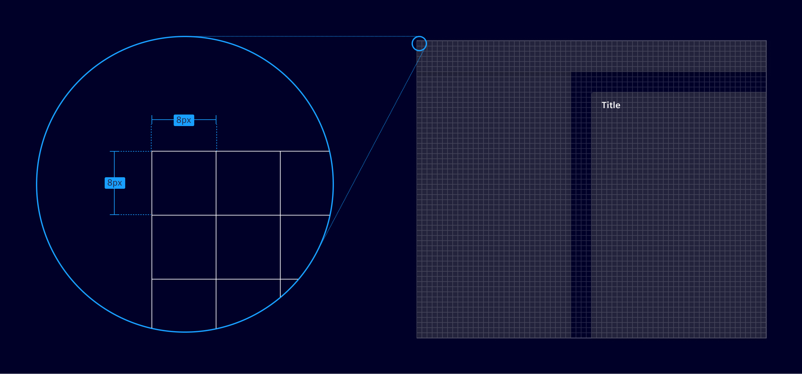
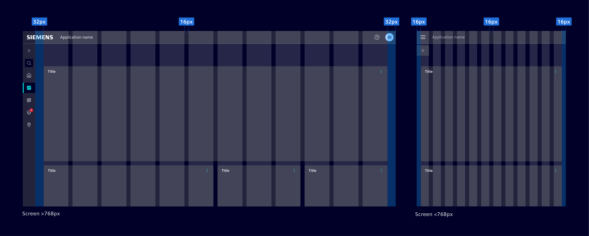
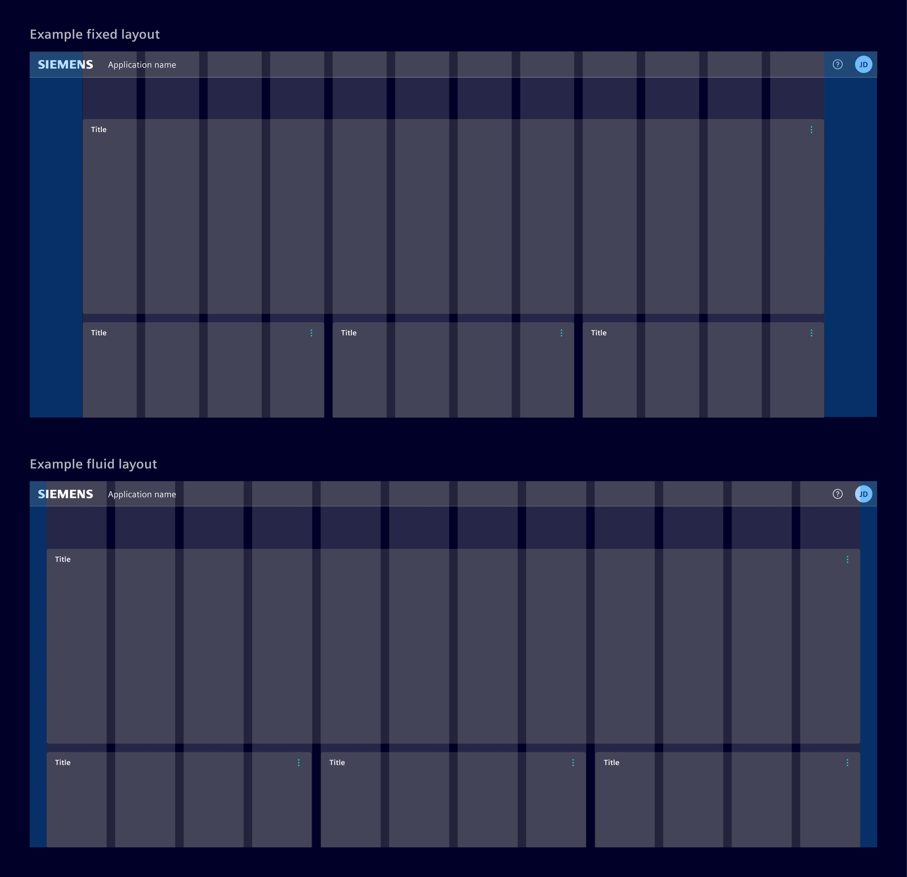

# Grid

**Layout principles** allow the arrangement of elements in an interface.
They help developers and designers to ensure consistency, efficiency,
and effective communication in the user experience.

## Usage ---

### Baseline grid

Layouts use a `8px` grid that is used to dictate the placement of
nearly all elements within the UI.
If needed, it is possible to use a `4px` grid to smaller adjustments.

### Breakpoints

Element uses the [Bootstrap](https://getbootstrap.com/docs/5.1/layout/breakpoints/)
breakpoints. Not all breakpoints need to be defined; reference them only when
design adjustments are required within specific breakpoint ranges.

### Margin, columns and gutters

The placement of content follows a flexible 12-column system where each column
has a gutter of `16px`.

For screens wider than `768px`, use a `32px` horizontal margin. For screens
narrower than `768px`, reduce the margin to `16px`.

### Fluid vs. fixed layout

Choose between a fluid or fixed layout width based on content requirements.

**Fixed layouts** have a maximum width defined for the content area.

**Fluid layouts** consume all the available screen space. It stretches the
content to accommodate the browser window's width, regardless of how wide it
becomes.

