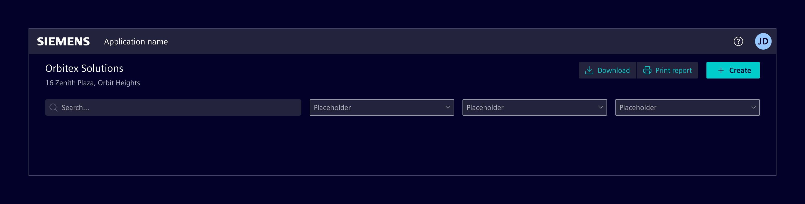
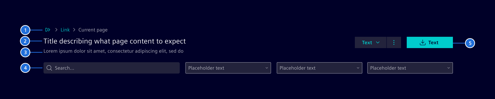
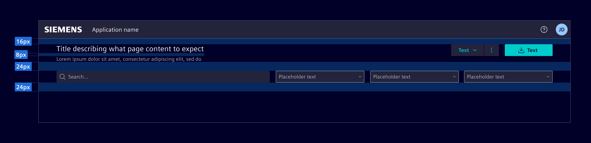
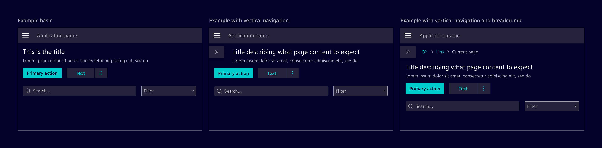

# Page header

**Page header** defines the top of the main content area. It arranges elements
that apply context to the current page.

## Usage ---

Use it to ensure a cohesive appearance at the start of an entire page. It
provides fundamental information users need while navigating the page.

### When to use

- To provide users with essential information to help them orient themselves and
  quickly understand the central topic and content of a page.
- To maintain design consistency across pages, creating a familiar and
  predictable pattern for users.

### Best practices for page header

- The title should be short and to the point.
- Maximal 1 page header per page.
- Don't use it at the top of smaller containers like cards.
- Customize the toolbar and page actions to suit your specific use case.
- Restrict the number of page actions to 3 to 5.
- Take responsive behavior into consideration. Ensure that all functions work
  well on all screen sizes.
- Refer to [typography](../typography.md) and [spacing definitions](spacing.md)
  for more information.

## Design ---

### Elements

1. **Navigation (optional)**: Helps users to orient themselves and efficiently
   navigate through the application with [links](../../components/buttons-menus/links.md)
   or breadcrumbs.
1. **Page title:** A clear, concise headline that immediately informs users
   about the content of the page.
1. **Description/Subtitle (optional):** Provides additional context or details
   to support the page title.
1. **Toolbar (optional):** Contains tools like search bars, filters, or others
   that help users interact with the page content.
1. **Page actions (optional):** Specific set of commands or operations that
   users can perform on the current page.

### Placement

- The vertical space between the page header and top element is `16px`.
- Use the text style `H2 Heading` with a `text-primary` color for the page title.
- If a description or subtitle is needed, the use the text style `Body 2` with a
  `text-secondary` color. The vertical space between the title and subtitle must
  be `8px`.
- The vertical space between the *Page Title* and the next element must be
  `24px`.

Page header must always be left aligned in relation to the rest of the content
in the screen.

### Responsive behavior

Adjust the items so that they remain easily accessible and usable. Adapt to
various screen sizes by stacking elements while preserving defined spacings.
When not all actions can be displayed, prioritize the visibility of the most
crucial and frequently used actions.

## Code ---

### Usage

Element provides CSS layout classes to support building a page header.
They are responsive and will automatically reserve space for the vertical-navbar
and the side-panel.

- `.si-layout-header` is a container class around the title, subtitle and actions
    - `.si-layout-title`, must be `h2`
    - `.si-layout-subtitle`, should be `p`
    - `.si-layout-actions`, defines the area for buttons or the content action bar

If you have a toolbar, add 16px bottom margin to the content be for example adding the
utility class `.mb-6`.

#### .si-layout-actions

When using the `<si-content-action-bar>` to provide page actions, ensure to add the `.si-layout-actions`
CSS class directly to the `<si-content-action-bar>` element and the `<si-content-action-bar>` element as
a direct child under the element with the `.si-layout-header` class. Otherwise, the responsive behavior
will not work. If you need to wrap the `<si-content-action-bar>` element, you need to make sure that you
define the required width in the parent container to enable the `<si-content-action-bar>` to be able to
expand.

Use the [`<si-menu-bar>`](../../components/buttons-menus/menu.md) component, if you do not need a responsive
collapsible menu and only have a reduced number of menu items or use normal buttons.

<si-docs-component example="si-page-header/si-page-header" height="600"></si-docs-component>
