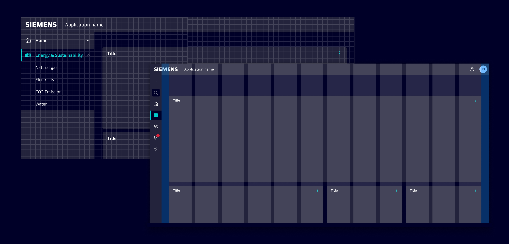

# Layouts

**Layout principles** allow the arrangement of elements in an interface.
They help developers and designers to ensure consistency, efficiency,
and effective communication in the user experience.

Effective layout design presents the information in a logical, coherent way and make
the content easier to understand.

## Best practices

- Know your use case. Understand how the information on the page will be used.
- Always use the grid system to create consistent alignment and organization of elements on the page.
- Avoid center-aligning elements; prefer left alignment.
- Group related content in cards.
- Arrange elements on the page based on their importance and the intended user flow.
- Use size, spacing, and visual cues to guide users attention and emphasize key information.

## Content

The Element layouts are describes in the following chapters:

- [Anatomy](anatomy.md) describes the common building blocks of an Element application page.
- [Header](header.md) describes the top section of the main content area.
- [Content layouts](content.md) refer to standardized templates for arranging visual elements and content on a page.
- [Grid](grid.md) defines the underlying grid system for element placement.
- [Spacing](spacing.md) defines spacing between elements.
