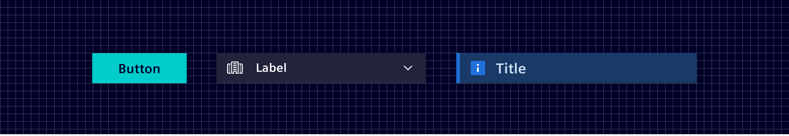
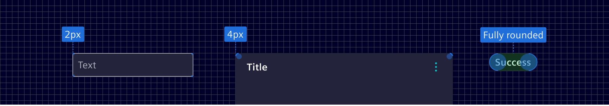
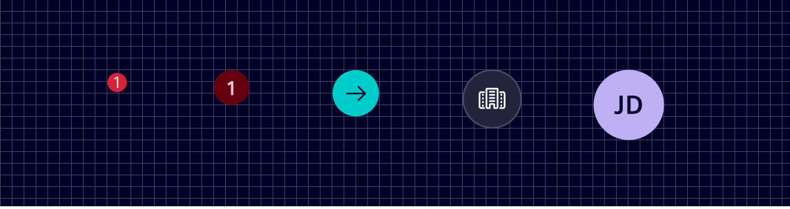

# Shapes

A shape is the form of an object. Shapes are used to identify components, direct attention to them, and express brand.

## Usage ---

*Element* is primarily comprised of *circles* and *rectangles*. A set of standard shapes and sizes is used across the system.
Shapes are an essential component of the *Element* brand.

### Rectangles

Rectangle shapes are used in buttons, headers, navigation menus and tabs.



### Rounded rectangles

Rounded rectangles maintain a rectangular shape with softened corners. The corner radius varies depending on the element:

- `2px radius`: Used for subtle softness while retaining a rectangular look, such as in inputs.
- `4px radius`: The default for container elements like cards.
- `100% radius` (fully rounded): Used for pill-shaped elements, like badges.



### Circles

Circle shapes are used in multiple places like lists, notifications, and avatars.



## Specification ---

### Tokens

Token               | Radius
--------------------|--------
`$element-radius-0` | `0px`
`$element-radius-1` | `2px`
`$element-radius-2` | `4px`
`$element-radius-3` | `8px`

Radius is set for all 4 sides unless specified otherwise.

## Code ---

All *Element* shape variants are accessible as `rounded-` CSS utility classes.

Besides that, the full range of [Bootstrap's border utilities](https://getbootstrap.com/docs/5.1/utilities/borders/#border-radius)
can be used. Since `rounded-2` is the default shape for *Element*, it is also
mapped to Bootstrap's shorthand `rounded` CSS class, as well as all side utility
classes.

<si-docs-component example="shapes/shapes" height="300"></si-docs-component>

### Sass Variables

The shape tokens for each *Element* shape can also be alternatively used as SCSS
variables within stylesheets.

```scss
@use '@spike-rabbit/element-theme/src/styles/variables';

border-radius: variables.$element-radius-0;
border-radius: variables.$element-radius-1;
border-radius: variables.$element-radius-2;
border-radius: variables.$element-radius-3;
```
