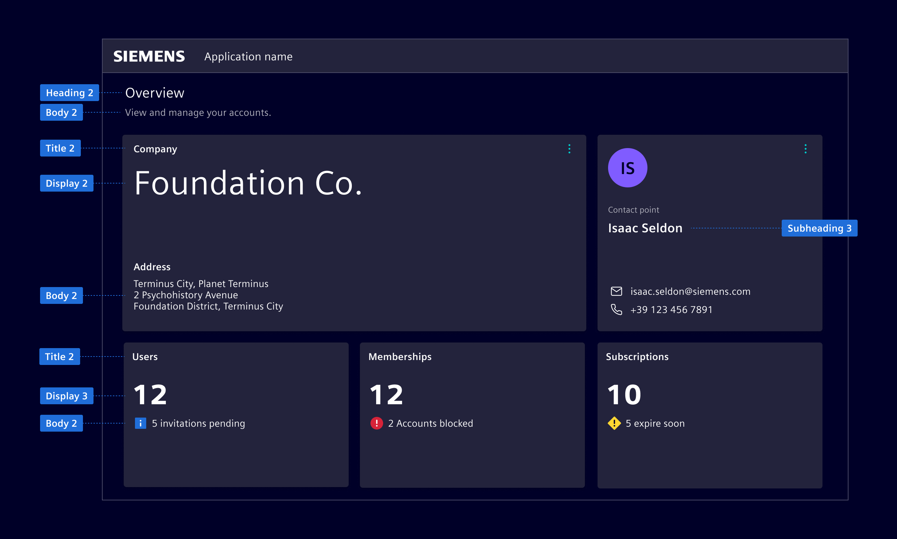
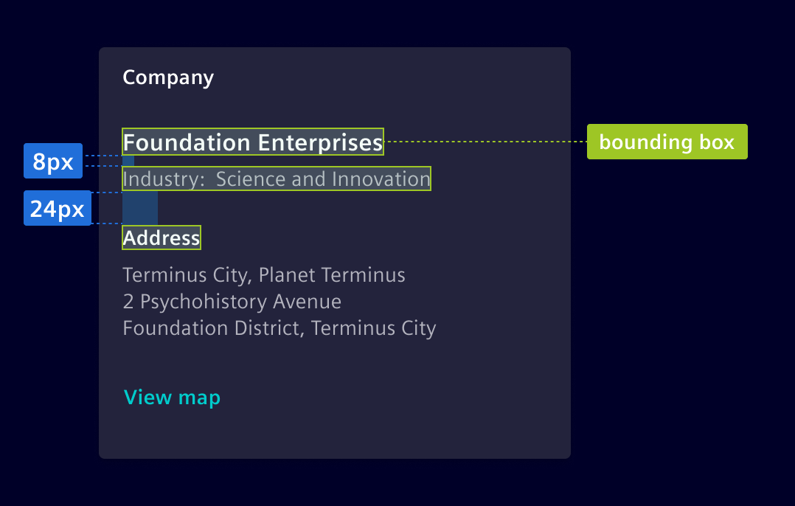
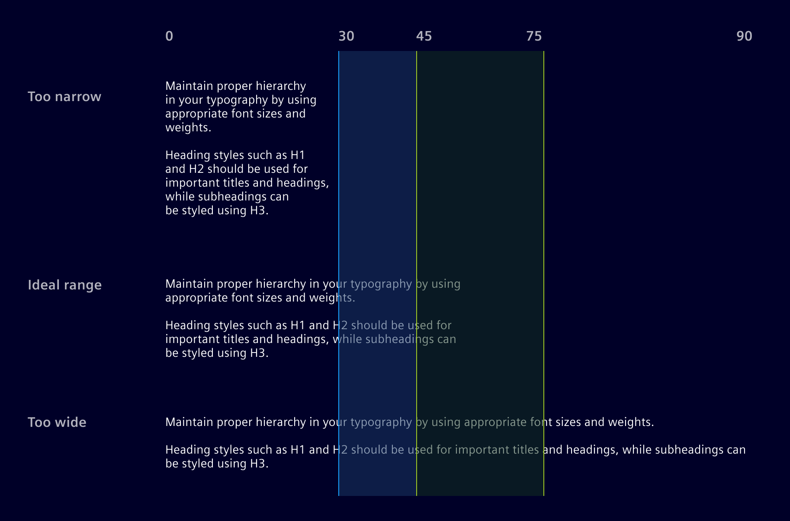

# Typography

<!-- markdownlint-disable MD013 -->

> **Note:** The Siemens font is part of the Siemens branding and
> cannot be used for none Siemens applications. Element comes with
> a default font that is not part of the Siemens branding. The default
> theme is not documented.

Typographic hierarchy is defined by text size and color. Each style can use
color variants if necessary.

## Usage ---

For a cohesive typography experience, *Element*'s type scale uses the Siemens
Sans typeface.
Hierarchy is communicated through differences in font weight (Roman/Regular and Bold) and
size.

<si-docs-component example="typography/typography" editor="false" height="380"></si-docs-component>

### Best practices

- Respect the typographic scale order for consistent and hierarchical design.
- Consider the purpose and context of the text when selecting a type style.
Headings, subheadings, and body text each serve distinct functions and should be chosen accordingly.
- Combine font weight, size, and color to establish hierarchy, utilizing lighter colors
  or smaller font sizes to de-emphasize secondary content.

## Design ---

*Element* defines 9 different type styles. It follows the
HTML semantic, while omitting the `H4`, `H5` and `H6` heading to reduce visual
complexity of titles within an application.

### Type scale

Line heights are computed using `font-size + 1/8rem` (used in buttons,
navigation, tables…).

Type             | Size (rem) | Line Height (rem) | Family       | Style
-----------------|------------|-------------------|--------------|------
Data Callout     | 3          | 3.125             | Siemens Sans | Roman
H1 Heading       | 1.85       | 2                 | Siemens Sans | Roman
H1 Heading Black | 1.85       | 2                 | Siemens Sans | **Black**
H2 Subheading    | 1.25       | 1.5               | Siemens Sans | Roman
H3 Subheading    | 1.125      | 1.25              | Siemens Sans | **Bold**
Title 1          | 1          | 1.125             | Siemens Sans | **Bold**
Body 1           | 1          | 1.125             | Siemens Sans | Roman
Title 2          | 0.875      | 1                 | Siemens Sans | **Bold**
Body 2           | 0.875      | 1                 | Siemens Sans | Roman
Caption          | 0.75       | 1                 | Siemens Sans | Roman
Display 1        | 3.5        | 4.5               | Siemens Sans | Roman
Display 2        | 3          | 4                 | Siemens Sans | Roman
Display 3        | 2.5        | 3.25              | Siemens Sans | **Black**
Display 4        | 2.5        | 3.25              | Siemens Sans | Roman

!!! info "Type Style Font Sizes"
    All font sizes are defined in **rem** (the root em size) based on the root
    element size. The Element Design System defines **1 rem as 16 px** while
    also applying this fixed conversion ratio within the implementation.

### Applying the type scale

- Choose **Heading 1** or **Heading 2** as the main title based on spacing
  requirements. If using Heading 1, follow it with Heading 2 for major
  section titles.
- **H3 subheading** serves as a secondary heading.
- **Title 1** and **Title 2** are used for cards or less important section titles.
- Use body styles within components and text blocks, with **Body 2** as the default.
- Use **Caption** for small, supplementary text providing additional context.
- Use **Display** styles in widgets, key visual elements, hero sections or any area where more prominence is required.



### Using the bounding box

The vertical height of the text, known as the bounding box, is determined by the line-height.
The value of the line-height is critical to make sure text aligns to the 8px grid.

Use the height of the bounding box together with top and bottom margin to determine spacing.



### Line length

Wide lines of text are harder to read;
aim for 45-75 characters per line on desktop, and 30-45 on mobile for optimal readability.



### Color usage

Color is used in text to communicate information to the user. Color variants
have meaning and are used to call attention to an action. The color of text
must follow one of the [predefined color variants](colors/ui-colors.md) and must not
use any of the other defined colors.

<style>
si-docs-color {
  display: block;
  height: 30px;
  width: 30px;
  border-radius: 50%;
}
</style>

See the [Text Colors](colors/ui-colors.md#text) chapter.

## Code ---

### Type Styles Classes

Implementation of typography is done via [Bootstrap's typography system](https://getbootstrap.com/docs/5.1/content/typography/).
Mosts scenarios allow you to use the HTML semantic (e.g. `h1`, `p`) directly, all the required
styles are set by default.

In case you can't use the HTML semantic (*e.g. apply a text style to a non*
*associated HTML tag*) or you have to use a type style without matching
semantic, you can use the `.si-` text classes.

<si-docs-component example="typography/type-styles" height="300"></si-docs-component>

### Display Styles Classes

The display styles are provided as `si-display-{1,2,3,4}` and are
mapped to the related Bootstrap classes.

<si-docs-component example="typography/display-styles" height="280"></si-docs-component>

### Typography Specification

All font-sizes, line-heights and font-weights are specified as SASS
variables, which can be used if required. The variables come in the form of
`$si-font-size-[name]`, `$si-line-height-[name]`, `$si-font-weight-[name]` and
are defined in [_typography.scss](https://github.com/siemens/element/tree/main/projects/element-theme/src/styles/variables/_typography.scss).

```scss
@use '@spike-rabbit/element-theme/src/styles/variables';

font-size: variables.$si-font-size-h1;
line-height: variables.$si-line-height-h1;
font-weight: variables.$si-font-weight-h1;
```

We use the specifications for defining the style CSS classes and for configuring
Bootstrap's typography system.

### Color Variants Classes

Changing the color of a text can be done using bootstraps utility classes,
without the need to of any custom SASS styling and is recommended in most cases.
The default text color is applied automatically and only has to be defined, if
a higher level component overwrites it.

<si-docs-component example="typography/color-variants" height="380"></si-docs-component>

All color variants can also be applied alternatively using SASS. It is heavily
recommended to use the contextual colors for this:

```scss
@use '@spike-rabbit/element-theme/src/styles/variables';

color: variables.$element-text-primary;
color: variables.$element-text-secondary;
color: variables.$element-text-disabled;
color: variables.$element-text-active;
background-color: variables.$element-base-warning;
background-color: variables.$element-base-danger;
color: variables.$element-status-danger-contrast;
background-color: variables.$element-status-danger;
```

See [_semantic-tokens](https://github.com/siemens/element/tree/main/projects/element-theme/src/styles/variables/_semantic-tokens.scss).

### Bootstrap Typography Utilities

Further typographical styling can be done using Bootstrap's wide range of font
and text utility classes. They closely follow the HTML semantic and can be used
without any additional styling.

<si-docs-component example="typography/bootstrap" height="400"></si-docs-component>
