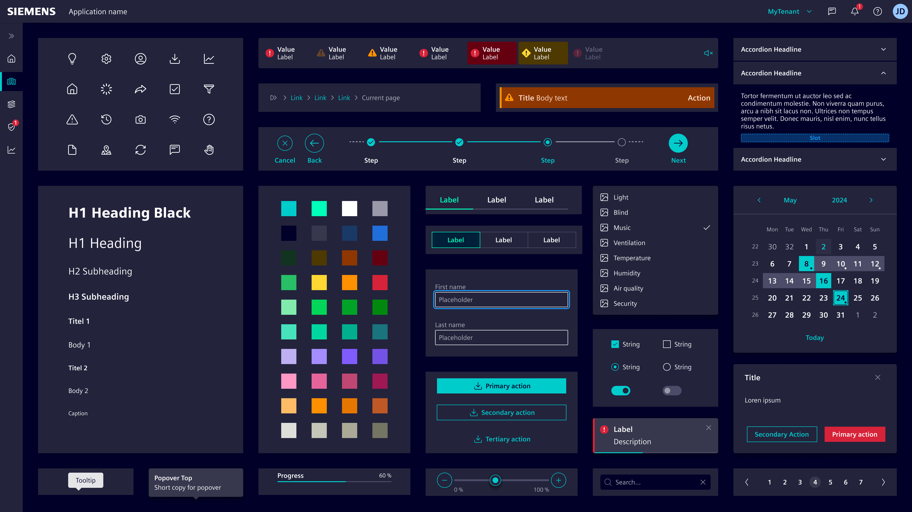
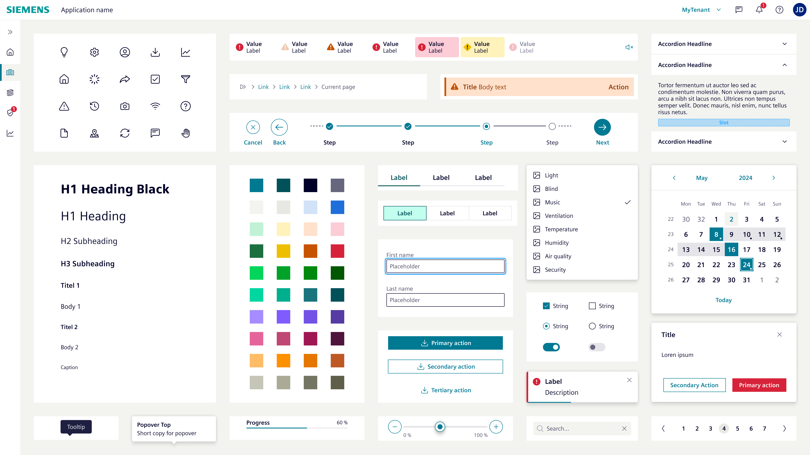

# Siemens Element Design System

Siemens Element is a design system of the smart infrastructure domain
that implements the Siemens Design Language in Angular. It includes UI
components, design tools and resources, human interface guidelines, and
a vibrant community of contributors.

## Angular components

We provide a rich set of reusable [Angular components](components/index.md)
which implement the Element design system. The components are developed in the
[siemens/element](https://github.com/siemens/element) repository on GitHub.

## Playground

Open our [demo playground](https://element.siemens.io/element-examples/#/overview)
to see examples for all our components.

## Figma design assets

Our Figma library contains all designed components, styles, and blueprints
ready for app design.

- The Figma library is maintained within the Siemens AG Global account.
- Siemens employees can use the self-service to obtain a Figma license. For 
  guest access please contact us.
- The Figma library contains Siemens specific brand elements and is only
  accessible to Siemens employees and business partners.
- We are looking into ways to provide a publicly available Figma library.
