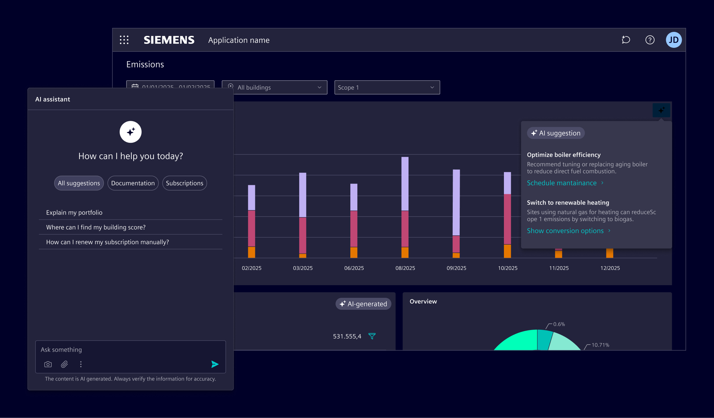
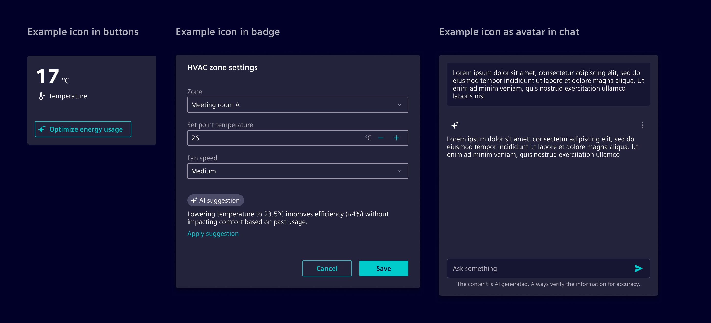

# Overview

AI interactions define how users experience AI-driven features in the product.

## Usage ---

AI features can appear as prompts, embedded actions, or automated suggestions triggered by user behavior.
This section explains how to represent AI visually and functionally.

### Best practices

- AI should be **purposeful**. It must exist for a clear reason, not just as a trend.
- AI should be **non-intrusive**. It must support user goals without distracting from the task.
- **Maintain user control**. Always enable users to refine, edit, or reject AI suggestions.
- Embed AI capabilities directly into the application interface rather than relying solely on a standalone chat function.
- Always use the established icons in the system to represent AI functions. Avoid introducing custom or inconsistent visuals.
- For products with AI or AI chat functionality, ensure that applicable terms of use and privacy information
  are referenced in the product’s legal documentation and user agreements.

## Design ---

### AI symbol

Use the `element-ai` icon to signal that AI is present or involved in a feature, action, or piece of content.
It helps users understand when AI is being used or has influenced an outcome.

The icon can appear in different contexts, such as:

- [Buttons](../../components/buttons-menus/buttons.md) that initiate AI actions.
- [Badges](../../components/status-notifications/badges.md) labeling content created or modified by AI.
  The secondary style is preferred for a neutral and consistent look.
- [Avatars](../../components/status-notifications/avatar.md) for AI-generated messages in conversational interfaces.

By default, the element-ai icon (double star) is used for general AI indication.
However, other AI-specific icons are available when more clarity is needed, such as `element-ai-message` or
`element-ai-code`. Use these when the function or context calls for more precision.
