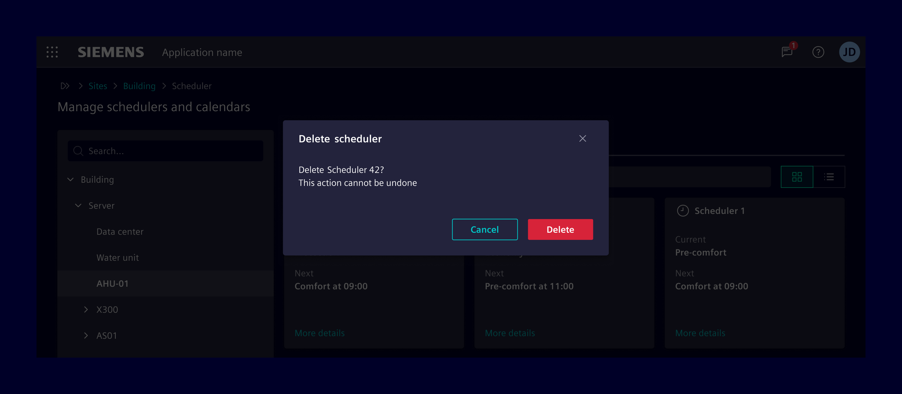

# Backdrop

**Backdrops** are full screen components that overlay other components. It
signals to the user a state change within the application. The backdrop
component will add a dimmed layer over the application.

## Usage ---

The backdrop component is used to provide emphasis on a particular element or
parts of it.

### When to use

- They are useful behind components that transition-in on top of other content
  and can be used to dismiss that component.
- As background for modals to catch the user’s full attention to something more
  important.

### Dos and don'ts

- Allow to *tap outside* to give the user a way to escape.
- Do not use the pattern backdrop to show error, success, or warning messages.
  Keep them on the page.
