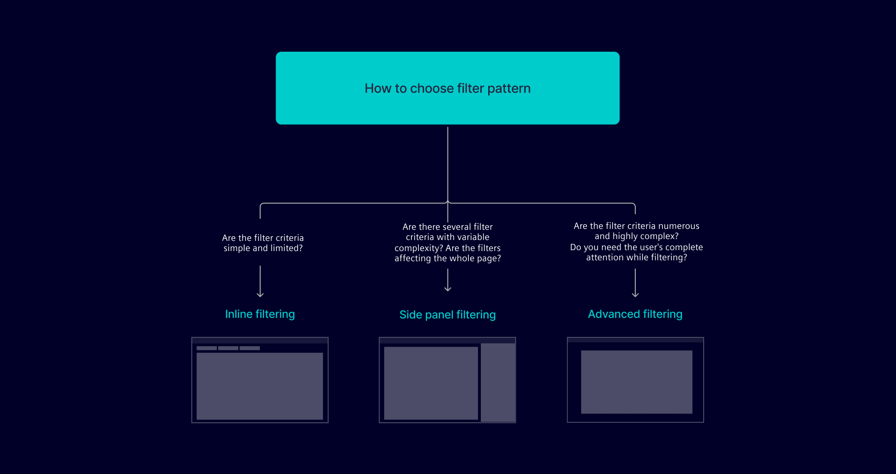
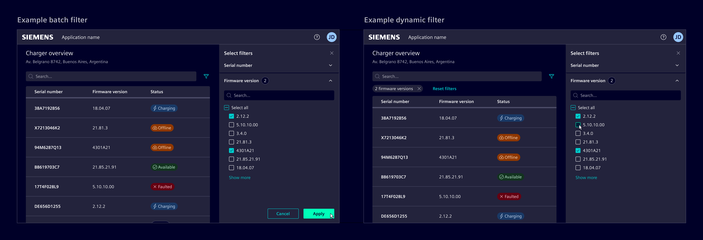
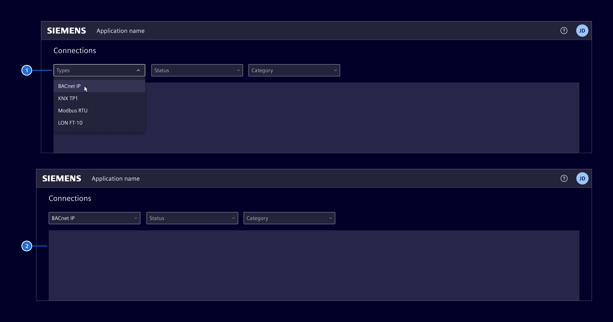
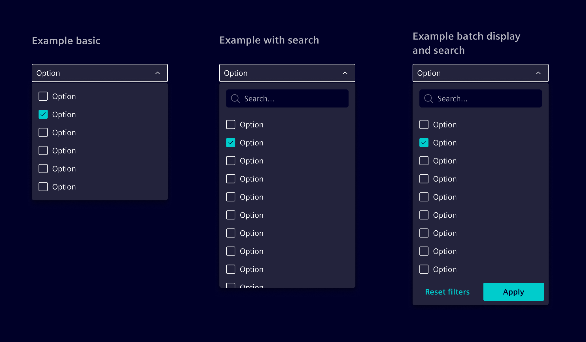
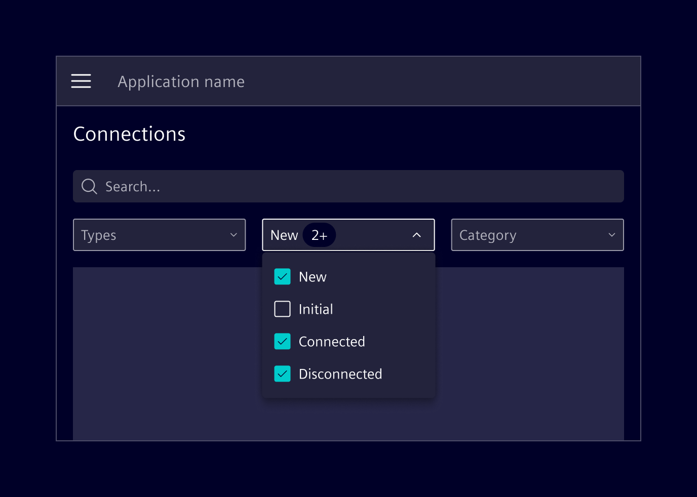
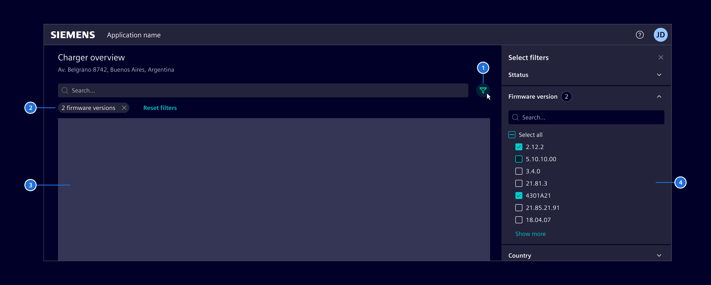
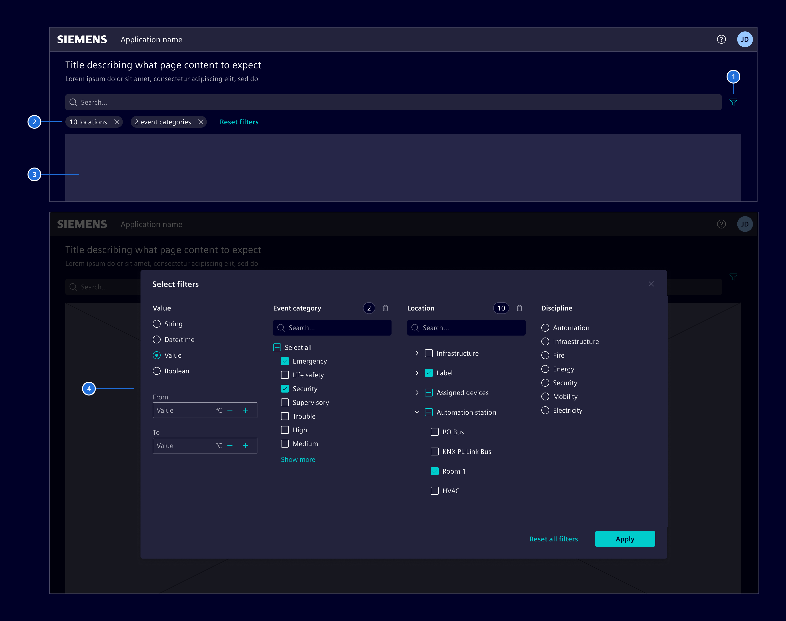
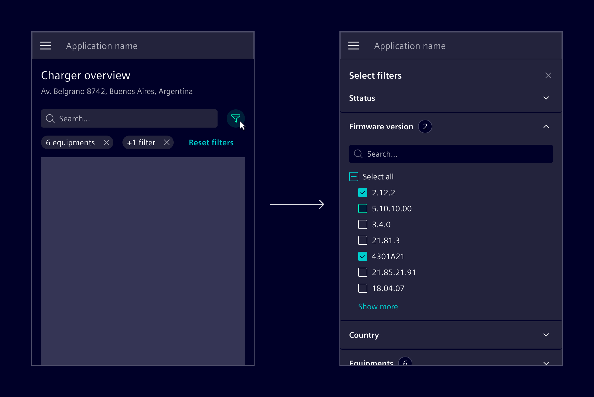
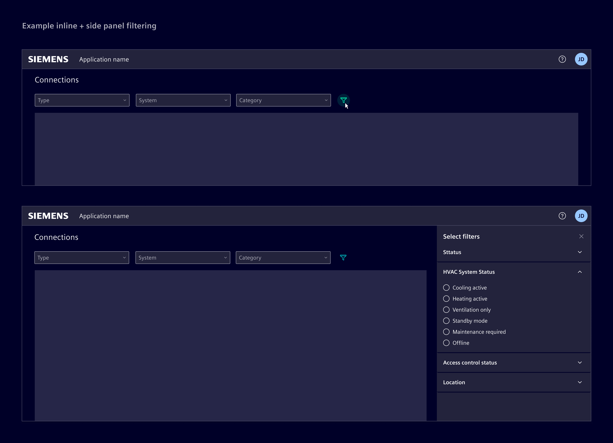

# Filter

Filters allow users to refine the displayed information based on specific
attributes of their choice.

## Usage ---

Filter parameters and functionality are highly dependent on a particular use
case. The following proposals should serve as an introductory guide.

In terms of the positioning of filters, and where they should be placed on the
page, we recommend starting with one of the three options below. The decision
depends on the context and scalability needs.

### Filter selection

Choose the filter method that makes sense for both the user and the data
presented.

- **Single-select:** Only one attribute can be selected.
  E.g. using [radio buttons](../components/forms-inputs/radio.md) or [select](../components/forms-inputs/select.md).
- **Multi-select:** Multiple attributes can be selected.
  E.g. using [checkboxes](../components/forms-inputs/checkbox.md) or [advanced select](../components/forms-inputs/select.md).
- **Range**: Allows selection within a defined numerical or date range.
  E.g. using [slider](../components/forms-inputs/slider.md) or [date range](../components/forms-inputs/date-range-filter.md).

### Apply filters

**Batch display** lets users set multiple filters before submitting with an
`Apply` button. Use it when users need to make multiple selections across
multiple different categories.

**Dynamic display** updates results immediately upon user selection, removing
the need for an `Apply` button. Use it when immediate feedback or results are
desired after each filter change.

### Applied filter visualization

Use the [filter bar](../components/sorting-filtering/filter-bar.md)
to display the specific filters that are applied. This is an optional feature,
intended for situations where the current filter selection is not easily visible
elsewhere.

To indicate the total count of active filters, use the `information` type 
[badge](../components/status-notifications/badges.md) component.

### Best practices

- Always make it clear which filters are active.
- Organize filters by understanding and aligning with user priorities.
- If a category has more than *7-10* options, consider ways to group filters or
  use a `Show more` type of functionality.
- If there are many filter options, consider adding a search functionality
  within the filter itself. For multiple filter categories, either add a search
  input for each one or provide a global search input.
- Applied filters should be easy to remove.
- Provide clear and descriptive labels for filters.
- Use common UX writing forms for filter interactions like `Reset filters`,
  `Select all`, `Deselect all`, and `Apply`.
- Refer to [loading patterns](../patterns/loading.md) for progress indication if filter changes cause a delay of +1 sec.

## Design ---

The following examples show the look and functionality of filters. Adjust the
designs according to a specific use case, while considering its users and the
available/desired data to display.

### Inline filtering

This layout arranges filters horizontally above the data for immediate user
access. They can be placed above specific parts of the page, making it clear
that only those items will reflect the filter input. It's best suited for simple
filter types.

Use the [select, advanced select*](../components/forms-inputs/select.md), and
[input button](../components/buttons-menus/buttons.md) for this
filter type.

> 1. Filters, 2. Filtered data/content

It's generally acceptable to show around *7-10* options at once. If there are
more options than this, consider adding a search functionality.

The applied filters should be shown within the input field itself. If they
exceed the available space, group the selections in a single filter pill
(e.g. using `+3`).

If multiple selections are made, a filter bar can be used to present all the
selected filters more clearly.

### Side panel filtering

This layout optimizes screen real estate by keeping the filters compactly
organized in the [side panel](../components/layout-navigation/side-panel.md).
The side panel can be expanded when the user selects the filter button. If
there are filter categories, they can be organized with an [accordion](../components/layout-navigation/accordion.md).

Use it when presenting a wide variety of filter options that impact the entire
page, allowing users to access filters without leaving the main content.

> 1. Filter button, 2. Applied filters, 3. Filtered data/content, 4. Side panel
> with filters

### Advanced filtering

For complex searches, use a [modal](../components/layout-navigation/modals.md) or separate page to display filters—this helps users stay focused while refining results. 
If many categories are present, they're arranged in columns of equal width.
Users can scroll through the area for more options, and if the columns exceed
the available horizontal space, they can be stacked.

> 1. Filter button, 2. Applied filters, 3. Content to be filtered, 4. Modal with
> filters

#### Responsive behavior

For smaller screens, ensure that filtering options are presented in a
sufficiently large format. As an example,
use either a [modals](../components/layout-navigation/modals.md) or
[side panel](../components/layout-navigation/side-panel.md) with accordions to
expose filtering with multiple options.

#### Combining layouts

Different filtering scenarios may require hybrid solutions that blend multiple
layout styles.

- **Inline + side panel:** Use inline filters for quick, primary selections.
  For detailed filtering, add a side panel. This balances immediate access with
  deep-diving functionality.
- **Inline + advanced filtering:** Inline filters address basic needs, while
  advanced filtering in a modal or separate page caters to intricate searches or
  guided scenarios.

