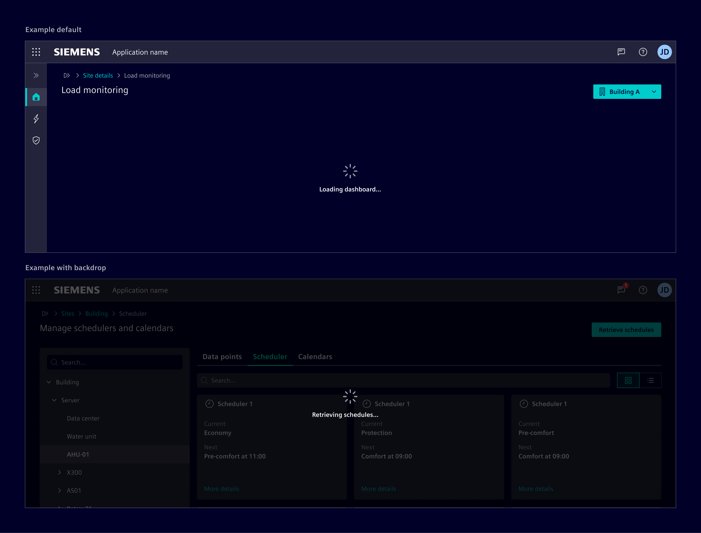
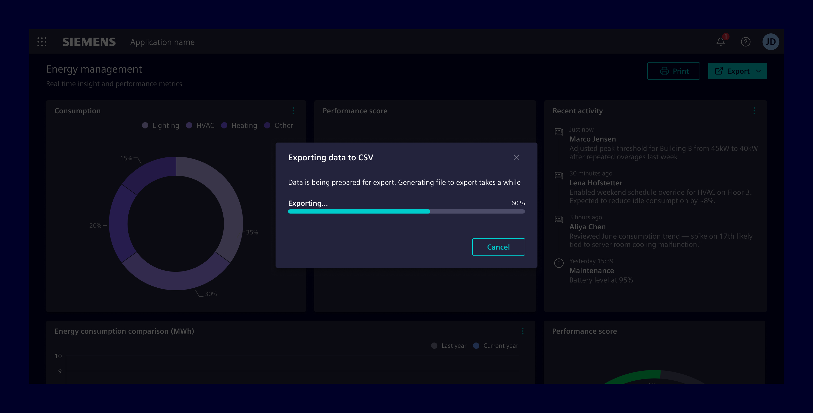
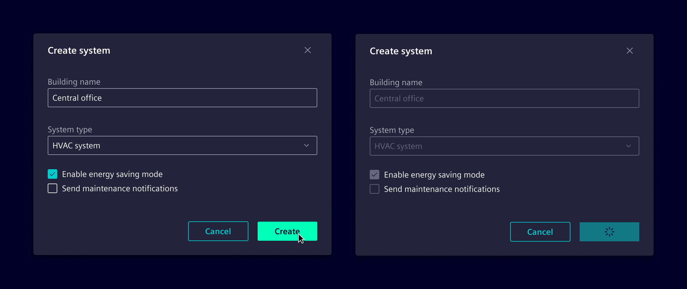

# Loading

**Loading indicators** offer visual feedback during data retrieval or processing, reducing uncertainty, preventing unnecessary interactions, and enhancing perceived performance.

## Usage ---

Loading indicators are an umbrella term for feedback patterns during ongoing operations.
While loading and progress are often used interchangeably, they differ:

- Loading covers processes involved in retrieving or preparing data, typically with unknown-duration feedback (e.g., initializing features, loading a page).
- Progress provides measurable feedback on task advancement, typically shown as percentages or steps (e.g., exporting a file, uploading data, completing a multi-step process).

### How to choose loading indicators

Loading indicators should be used based on the expected duration of the process:

- **< 1 second**: No loading indicator is displayed. The action is perceived as instantaneous.
- **1 .. 3 seconds:** Use an indeterminate indicator, such as a [spinners](../components/progress-indication/spinner.md) or [skeletons](../components/progress-indication/skeleton.md),
  to show that the process is ongoing but the duration is uncertain.
- **3 .. 10 seconds:** Use a determinate indicator, like a [progress bar](../components/progress-indication/progress-bar.md), to inform the user about the status of the loading process.
- **> 10 seconds**: Perform process at the backend and allow the user to continue working.
Provide a status on the affected entity (e.g., "Scanning network…") and notify the user when the process is completed
(e.g., [toast notification](../components/status-notifications/toast-notification.md)).

### When to use

- When process that takes more than 1 second.
- When performing actions that involve waiting for external processes (e.g., API calls).
- When transitioning between major views or content updates.
- When process is performed asynchronously.

### Best practices

- Avoid overuse. Only use loading indicators when delays are unavoidable.
- Inline loading indicators should allow users to continue interacting with other areas of
  the interface when appropriate (e.g., when only a section is loading).
- In situations where interactions are tied to the loading (e.g., during form submission), it’s best
  to disable the relevant elements temporarily.
- Implement the process (e.g., on the backend) in a way that prevents any invalid states,
  even if the network is interrupted or the user refreshes the browser at any time.
- Size indicators proportionally to their associated components and place them where users expect feedback.
- Consider complemeting the loading indicators with a brief text for context.

## Design ---

Loading indicators should be applied based on the scope and impact of the action.

### Global loading

**Global loading** is used when an action affects the entire page or application, such as during a critical update or initial loading.

[Spinners](../components/progress-indication/spinner.md) can be placed centrally to indicate that the entire interface is processing.
They can be paired with a [backdrop](../patterns/backdrop.md) to block user interaction.
A `32px` size is recommended to make the spinner prominent but not overwhelming.

[Skeletons](../components/progress-indication/skeleton.md) display placeholder content, maintaining the page's layout and structure during loading.

[Progress bar](../components/progress-indication/progress-bar.md) can be used as a determinate indicator to help users see how much of a task is complete,
e.g., during data exports.

### Inline loading

Applies to actions that affect only a specific part of the interface, such as loading content within a section of a page or updating a component.

Inline [spinners](../components/progress-indication/spinner.md) can be placed near or within individual components, to indicate localized processing.
Avoid placing multiple adjacent loading indicators; instead, use a single indicator to represent the entire process.

When placed within buttons, the spinner replaces the button’s label and icon to show that the action is being processed.
Use a [loading button](../components/progress-indication/spinner.md#loading-button)
when the action being performed is directly tied to the button itself, and the user needs clear feedback that their interaction with the button is being processed.

It is recommended to use a `16px` spinner for small areas, a `24px` spinner for larger components,
and a `32px` spinner for extensive sections or full-page loading indicators.
However, the size can be adjusted to proportionally match the components they accompany.
