# Notifications

Notifications inform users about important updates, system events, or required actions.

## Usage ---

Notifications keep users updated on changes, prompt timely responses to important updates, and guide them through interactions.
They can be delivered through various channels, such as push notifications, emails, or texts.

Element provides guidance on **in-app notifications**, which deliver updates and feedback within the application experience.

### Notification anatomy

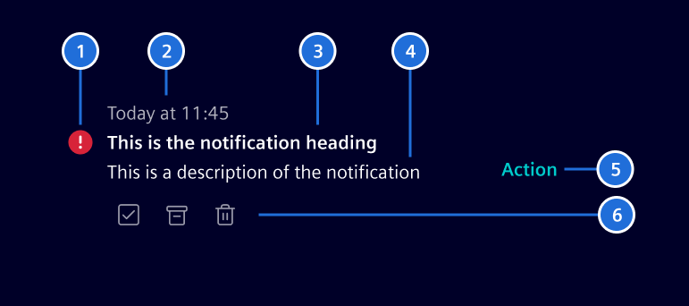

Each notification typically consists of the following elements:

1. **Indicator:** Indicates priority and/or type using a color and icon.
1. **Timestamp:** Shows when the event occurred.
1. **Heading:** A concise phrase that quickly conveys what happened.
1. **Description:** Provides details if needed.
1. **Primary action:** The main action related to the notification.
    It can be a single button or a menu with multiple options.
1. **Quick actions:** Allows users to take quick action, such as dismissing or responding.

Except for the notification title and timestamp, all elements are optional.

### Notification indicators

The notification indicators reflect the state or condition of the notification, helping users understand its relevance.

- When differentiation is needed, **severity-based indicators** provide a clear response hierarchy.
Each severity level is paired with a color and icon to ensure consistency.

- If needed, a [circle status](../components/status-notifications/circle-status.md) or
[avatars](../components/status-notifications/avatar.md) can be used to provide further context.

- If the content itself provides enough context, no visual indicator is needed.

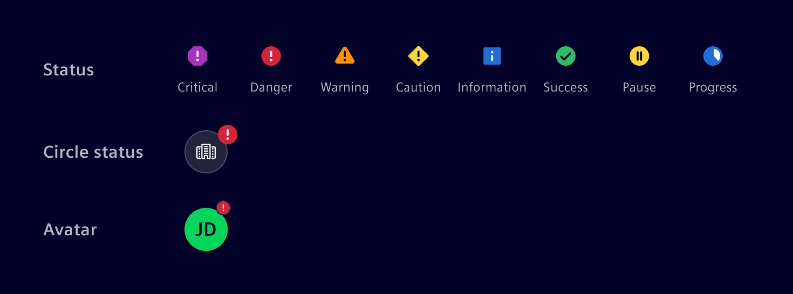

When a notification has read and unread states, the unread state is indicated by a dot and bold title text.

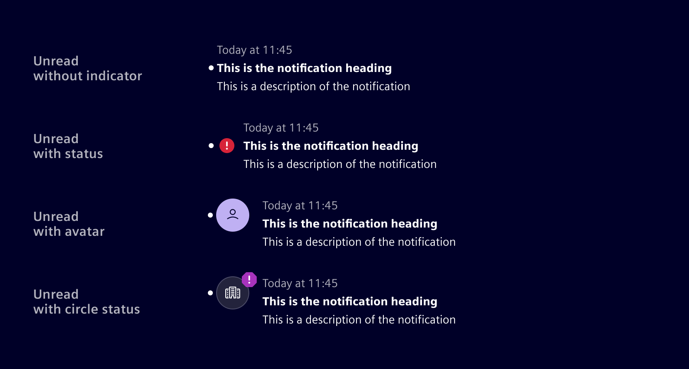

### Actions

The main purpose of a notification is to redirect users to the relevant page, task, or item it highlights. Depending on the notification's design, additional actions may also be available.

**Global actions** affect all notifications at once or adjust system-wide settings (e.g., settings, show all, dismiss all).

**Notification-level actions** apply to individual notifications for quick management. Common examples include:

- Dismiss: Removes the notification from the current view (e.g., popover, side panel, etc.)
  but keeps it in the notification center for future reference. Dismiss does not change the read and acknowledge states.
- Delete: Permanently deletes the notification from the system.
- Acknowledge: Confirms receipt, indicating that the user is informed and may take further action.
- Resolve: Used when the system can fix the issue automatically or the user is guided through a resolution process.

### Best practices

- Deliver notifications at the right moment to avoid unnecessary distractions.
- Categorize notifications to prioritize critical events.
- Allow users to manage notification settings where possible.
- Define clear thresholds for timestamps. Use relative time for recent events (e.g., "Just now", "5 minutes ago", "09:42", "Yesterday")
  and switch to absolute dates (e.g., "10/01/2024") for older events.
- Consider setting an expiration timeframe for transient notifications, but allow critical ones to persist until the issue is resolved.

## Design ---

## Choosing the right format

Selecting the right notification component depends on urgency, persistence, and disruption level.

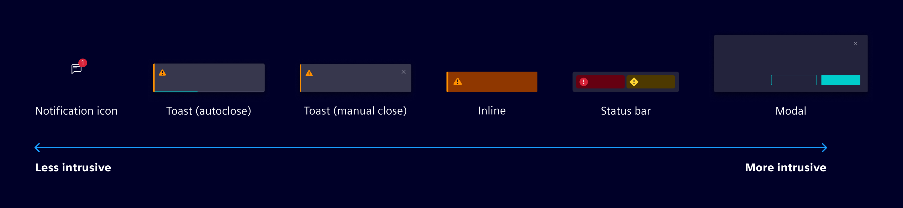

**Transient notifications** disappear automatically and don’t require user action.
Best for quick updates that confirm actions without interruption.

- Use [toast (autoclose)](../components/status-notifications/toast-notification.md)
  for brief, low-priority updates that confirm an action or system event (e.g., “Email sent”).

**Persistent notifications** remain visible until the user acknowledges or resolves them.
Used for ongoing awareness or required action.

- Use notification icon in the [application header](../components/layout-navigation/application-header.md)
  to provide access to a notification panel or popover where users can view and manage updates.

- Use [toast (manual close)](../components/status-notifications/toast-notification.md) when an update needs attention but isn’t urgent,
  such as "Limited connectivity" or "Scheduled maintenance in 30 minutes"

- Use [inline notifications](../components/status-notifications/inline-notification.md)
  for messages tied to a specific location or system state, such as "Energy consumption exceeds expected levels"

- Use the [status bar](../components/status-notifications/status-bar.md) for constant visibility without disrupting the workflow.

- Use [modals](../components/layout-navigation/modals.md)
  for urgent decisions that require immediate attention and block further interaction.

### Handling multiple notifications

To prevent overwhelming users, limit the number of visible notifications. Consider:

- Set a maximum number of displayed notifications. Collapse older ones into a summary when exceeded.
- Use a summary message (e.g., “3 new notifications”) to redirect users to a notification management view.
- Determine the summary status based on severity, this could be the most recent or the highest-priority notification.

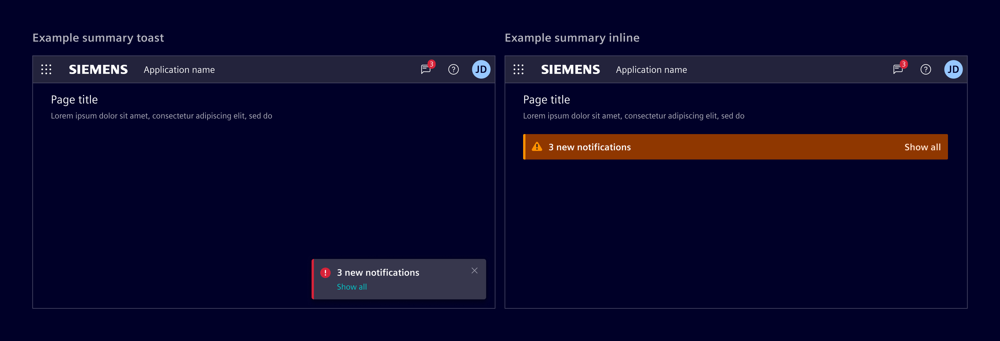

## Notification management

Toasts, inline messages, and other notifications can appear throughout the interface,
so a centralized view helps users review and manage them as needed.

The following examples show how to structure notifications, adapt based on the use case.

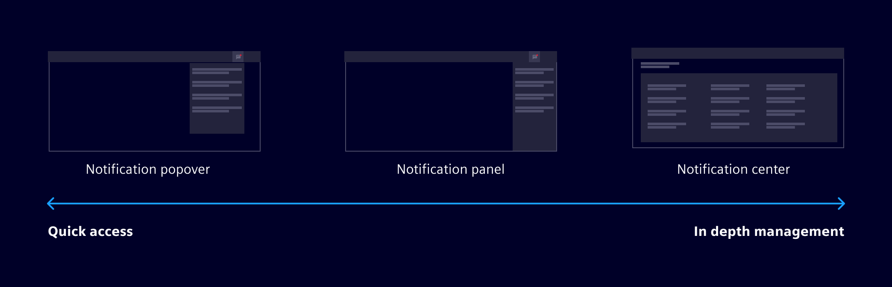

### Notification popover

The popover is accessed through the application header, providing quick,
non-intrusive access to recent notifications without disrupting the workflow.
Users can select a notification to be redirected to the relevant page, task, or item.

> 1. Global actions (optional), 2. Search (optional), 3. Notification, 4. Footer (optional)

The popover supports various actions. The footer and header are reserved for global actions.
Additionally, it can include a search function for quick filtering.

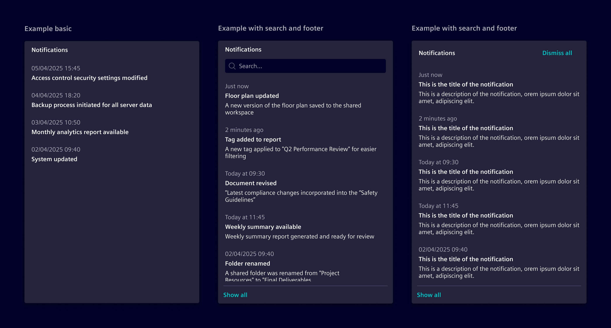

- Allow users to manage notification preferences through a settings link.
- If applicable, include a “Show all” option to access a full-page view for older notifications.

### Notification panel

Uses the [side panel](../components/layout-navigation/side-panel.md) for managing or browsing a larger number of notifications while maintaining the current workflow.
It provides more space for detailed notifications and supports additional functionality, such as filtering, grouping, and actions on individual notifications.
Just like in the popover, users can select a notification to be redirected to the relevant page, task, or item.

- If a side panel is already open, the notifications panel will replace it to ensure only one panel is active at a time.
- The panel should remain open when navigating between pages, allowing users to keep track of their notifications without interruption.

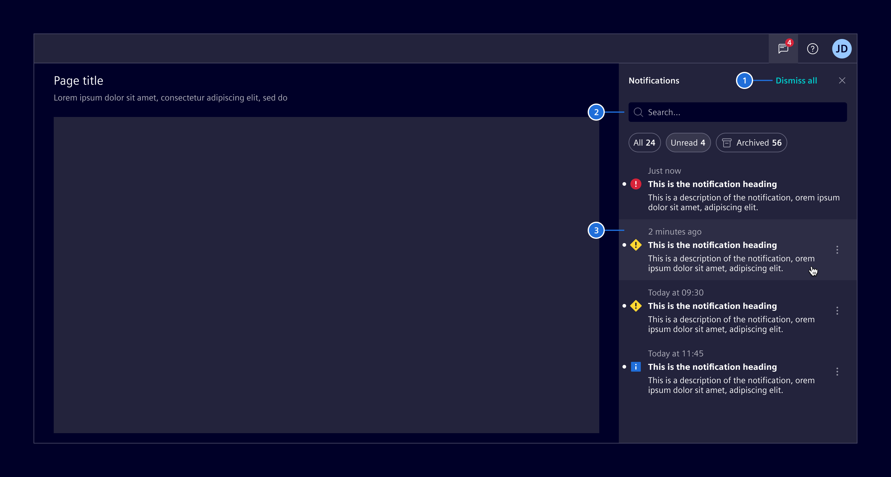

> 1. Global actions (optional), 2. Search (optional), 3. Notification

#### Action placement

- If there is only one action, place it on the same row as the text.
- If there are multiple actions, place them below the text.
- If there are +3 actions or actions that cannot be represented with a meaningful icon, group them in a menu.

Use icon-only actions for universally recognized meanings (e.g., trash for delete). If an icon isn't self-explanatory, display its label
at least once to help users learn their meaning. If an action cannot be effectively represented with an icon, use text-based buttons.

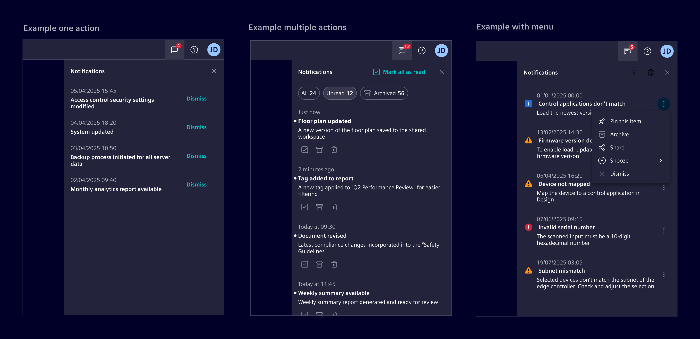

#### Groups

Notifications can be grouped by relevance, time, or any category to improve clarity:

- Use [tabs](../components/layout-navigation/tabs.md) for broad, mutually exclusive categories, helping users focus on one at a time.
- Use [accordions](../components/layout-navigation/accordion.md) for nested grouping within a category, allowing users to scan multiple groups without switching contexts.
- Use summary chips to provide a quick, at-a-glance overview of grouped notifications (e.g., "3 unread").

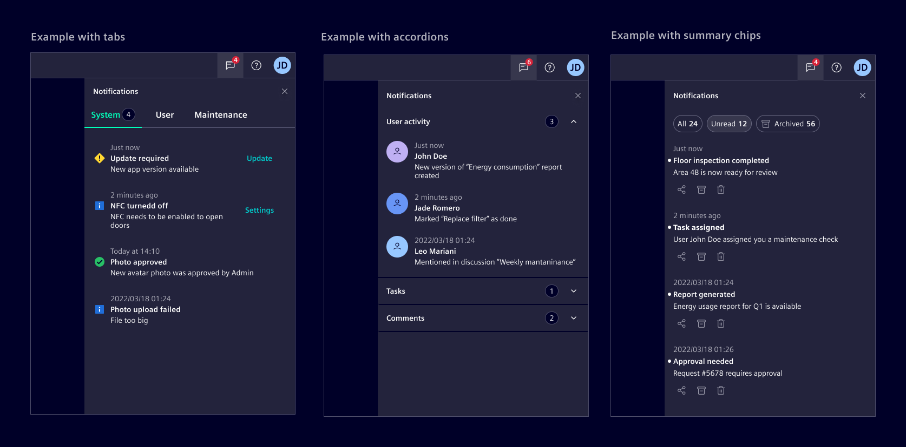

If combining methods, consider use tabs for main categories, accordions for nested groups, and summary chips for quick overviews.
If many categories are available, consider using filter methods.

### Notification center

A notification center is a dedicated full-page view where users can review, filter, and manage all past and current notifications in one place.
It can work independently or alongside other notification patterns, such as popovers and side panels.

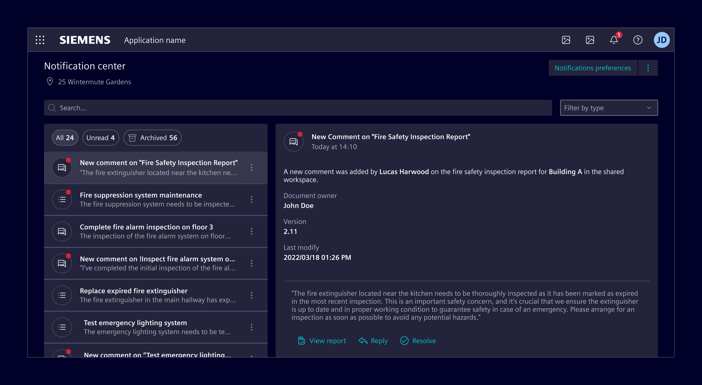
